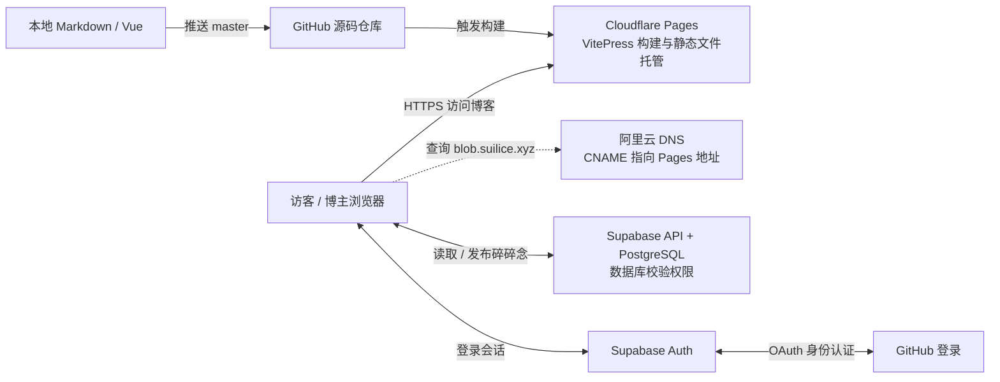

# 博客部署、登录与存储：流程和原理

博客使用 VitePress，代码继续放在 GitHub；Cloudflare Pages 构建和托管网站；Supabase 保存碎碎念并处理 GitHub 登录。访客可以阅读，只有指定账号可以发布。

## 各个平台负责什么

| 组成部分 | 职责 | 保存的内容 |
| --- | --- | --- |
| VitePress | 把 Markdown 和 Vue 组件构建成网站文件 | 源码在 GitHub，构建结果在 Pages |
| GitHub 仓库 | 管理文章、页面代码及版本，推送后触发部署 | Markdown、Vue、配置、锁文件 |
| Cloudflare Pages | 安装依赖、构建网站、通过 HTTPS 分发静态文件 | HTML、CSS、JavaScript、图片 |
| 阿里云域名与 DNS | 管理 `suilice.xyz`，把 `blob` 子域名指向 Pages | 域名与解析记录 |
| GitHub OAuth | 确认登录者对应哪个 GitHub 账号 | OAuth 应用及授权关系 |
| Supabase Auth | 将 GitHub 身份对应到 Supabase 用户，签发登录会话 | 用户 UID、登录身份与会话 |
| Supabase PostgreSQL | 持久保存碎碎念，检查每次写入是否有权限 | `moments` 表与 RLS 策略 |

浏览器先从 Pages 取得网站，再直接访问 Supabase 获取碎碎念。当前实现不需要自建后端服务器，也没有另外部署 Cloudflare Worker 或 Pages Function。

文章正文保存在 GitHub 的 Markdown 中；碎碎念正文保存在 Supabase 数据库中。重新部署博客、刷新页面或更换电脑，都不会清空已经成功写入数据库的帖子。

## 当前项目与核对范围

| 项目 | 实际配置 |
| --- | --- |
| 正式网址 | `https://blob.suilice.xyz` |
| GitHub 仓库 | `scattter/scattter.github.io` |
| Pages 项目 | [scattter-github-io](https://dash.cloudflare.com/56439f8e08d9eebe36282d56abded78d/pages/view/scattter-github-io) |
| Pages 默认域名 | `scattter-github-io.pages.dev` |
| Supabase 项目 | [blob](https://supabase.com/dashboard/project/dycpzdoyybpbqlittocw)，首尔区域 |
| Supabase API | `https://dycpzdoyybpbqlittocw.supabase.co` |
| 碎碎念入口 | `https://blob.suilice.xyz/moments` |

2026-09-29 整理时，已完成或已观察到的内容：

- 本地已实现登录、博主发布、分页读取与 JSON 导出；默认站点域名已配置。
- 已通过 Supabase 插件创建 `public.moments`、分页索引及公开读取策略，并启用 RLS；当时验证过 REST 读取返回 200、安全检查无告警。
- 公开密钥已写入本地 `.env.local`，该文件被 Git 忽略；`.env.example` 中的密钥为空是正常的。
- 已在 Chrome 页面看到 GitHub OAuth 应用 `blob`，首页与回调地址正确，Supabase GitHub Provider 显示已启用。
- 本地 `set-owner.sql` 已由你填写 UID；本地文件的修改不会自动执行到远程数据库。
- 已将 `yarn.lock` 中 164 个腾讯镜像地址改为 npm 官方地址，并新增 `.yarnrc` 固定源；axios 和高德依赖的官方下载与锁定校验值一致。

本次整理核对了本地实现，没有重新操作控制台、运行完整构建或验收线上登录发帖。Pages 最新部署、DNS/证书状态、SQL 是否执行及线上 Owner ID 是否一致，请按末尾清单确认。此前的“尚未启用登录”“没有用户”“域名无记录”等观察不能代表你后续手动配置后的状态。

下面是从数据库到上线的完整顺序；现有 Supabase 项目无需再次创建或建表。首次配置时，先部署可登录的页面，取得自己的 UID 后再开放发布。

## 1. 准备数据库（现有项目已完成）

如果以后重建环境：在 [Supabase](https://supabase.com/dashboard) 创建项目，在 SQL Editor 中执行 [supabase/schema.sql](./supabase/schema.sql)，并从项目 Connect / API 配置复制 **Project URL** 和 **Publishable key**。旧项目的 `anon` key 也可以使用。

`moments` 表只需要三个字段：

| 字段 | 作用 |
| --- | --- |
| `id` | 每条记录的 UUID；前端发布时生成，用于识别同一次提交 |
| `content` | 1–2000 字的纯文字，不能全部为空白 |
| `created_at` | 数据库自动生成的发布时间 |

表的读取策略允许访客查看所有帖子。初次只执行 `schema.sql` 后，RLS 尚无允许写入的策略，因此所有账号都不能发布；第 5 步才允许指定 UID 写入。

这里只需要公开的 Publishable / anon key。不要把 `service_role`、`sb_secret_...`、数据库密码或 GitHub Client Secret 填入 `VITE_` 环境变量，这些变量会进入前端产物。

## 2. 在 Cloudflare Pages 连接现有仓库

将这次代码提交并推送到 GitHub，然后进入 Cloudflare 的 **Workers & Pages → scattter-github-io → Settings**，修改现有项目配置即可，无需重复创建项目。

| 设置 | 值 |
| --- | --- |
| Production branch | `master` |
| Framework preset | VitePress |
| Root directory | 仓库根目录，留空 |
| Build command | `yarn docs:build` |
| Build output directory | `docs/.vitepress/dist` |
| Node 版本 | `22`，仓库已包含 `.node-version`；也可设置 `NODE_VERSION=22` |

不要直接使用框架预设的默认产物目录：本项目的文档在 `docs` 下。

在 **Settings → Variables and Secrets** 中配置 Production 环境变量：

| 名称 | 值 / 来源 | 用途 |
| --- | --- | --- |
| `NODE_VERSION` | `22`；也可由仓库的 `.node-version` 指定 | 构建运行时 |
| `YARN_VERSION` | `1.22.22` | 使用与锁文件一致的包管理器 |
| `SITE_URL` | `https://blob.suilice.xyz` | 构建 sitemap、canonical 和 robots.txt |
| `VITE_SUPABASE_URL` | `https://dycpzdoyybpbqlittocw.supabase.co` | 浏览器访问哪个 Supabase 项目 |
| `VITE_SUPABASE_PUBLISHABLE_KEY` | 本地 `.env.local` 中同名值，或 Supabase 的 Publishable key | 项目的公开 API 配置 |
| `VITE_SUPABASE_OWNER_ID` | 你的 Supabase User UID；首次部署可暂不添加 | 控制页面是否显示发布入口 |

保存后部署。以后推送 `master` 会自动触发部署；只发布碎碎念不需要重新部署。修改任何环境变量后都需要重新部署才会生效。

项目使用 Yarn 1 和仓库中的 `yarn.lock`。Cloudflare 当前构建镜像默认使用 Yarn 4，且不会从锁文件格式识别 Yarn 版本，因此需要显式设置 `YARN_VERSION=1.22.22`。不需要另写 GitHub Actions 来上传到 Cloudflare。原 GitHub Pages 工作流仍然保留，正式迁移完成后可在 GitHub Actions 中停用旧的 Deploy 工作流。

一次部署依次经过：**拉取 `master` 源码 → 安装依赖 → 执行 `yarn docs:build` → 发布 `docs/.vitepress/dist`**。本方案的构建参数针对源码分支 `master`；原工作流的 `gh-pages` 分支存放已生成的网站文件。

此前的 `axios-1.2.1.tgz: Request failed "616 undefined"` 发生在安装依赖的 Fetching packages 阶段。Yarn 会使用 `yarn.lock` 的 `resolved` 下载地址；只改默认 registry 不会自动改掉其中写死的腾讯镜像地址。因此此次同时修正了锁文件与 `.yarnrc`，依赖版本和完整性校验值未变。Cloudflare 需要部署包含这两个文件改动的新提交。

这些 `VITE_` 值会在构建时写入 JavaScript。只修改 Cloudflare 环境变量时，已经部署的文件不会随之变化，所以需要重新部署。本地 `.env.local` 被 Git 忽略，也不会随代码推送到 Cloudflare。

## 3. 绑定阿里云域名 blob.suilice.xyz

这个方案继续使用阿里云 DNS（此前查询到的 NS 为 `dns1.hichina.com` / `dns2.hichina.com`），只为 `blob` 子域名添加 CNAME，无需迁移主域名的 NS。

1. 本项目实际分配的 Pages 地址为 `scattter-github-io.pages.dev`，先确认该地址能打开成功部署的博客。
2. 在该 Pages 项目的 **Custom domains → Set up a custom domain** 中填写 `blob.suilice.xyz`，按提示进行域名关联。
3. 到阿里云 **云解析 DNS → 权威域名解析 → suilice.xyz → 解析设置 → 添加记录**，填写：

| 字段 | 值 |
| --- | --- |
| 记录类型 | `CNAME` |
| 主机记录 | `blob` |
| 解析请求来源 / 线路 | 默认 |
| 记录值 | `scattter-github-io.pages.dev`，不含 `https://` 或路径 |
| TTL | 默认即可，例如 10 分钟 |

4. 回到 Cloudflare 完成检查，等待 Custom domain 状态为 Active、HTTPS 证书就绪。
5. 确认 `https://blob.suilice.xyz/` 和 `https://blob.suilice.xyz/moments` 都能打开，再检查 sitemap 和 robots.txt。

先在 Pages 中关联域名，再添加 CNAME；只有 DNS 记录不算完成绑定。只操作 `blob` 记录，保留主域名和其他子域名的原有解析。`SITE_URL` 必须为 `https://blob.suilice.xyz`；`scattter.github.io` 是 GitHub 分配的地址，不能作为自己的域名搬到 Cloudflare。

两边配置的作用不同：阿里云的 CNAME 让浏览器找到 Cloudflare；Pages 的 Custom domain 告诉 Cloudflare 这个主机名对应哪个网站，并由它处理 HTTPS 证书。CNAME 是 DNS 别名，浏览器地址栏仍显示 `blob.suilice.xyz`，不会因此跳转成 `pages.dev`。`SITE_URL` 只影响生成的网站信息，不能替代 DNS 和 Custom domain 配置。

当前使用 Cloudflare Pages 国际网络，无需为了这次托管办理中国大陆 ICP 备案。阿里云域名实名认证仍需完成；以后若使用中国大陆服务器或大陆 CDN，再按相应服务要求办理备案。

## 4. 配置 GitHub 登录

1. 打开 [GitHub OAuth Apps](https://github.com/settings/developers)，找到现有的 `blob` 应用，核对下表；以后新建环境时可使用 **New OAuth App**：

| GitHub 字段 | 值 |
| --- | --- |
| Application name | 当前为 `blob`，名称可自定 |
| Homepage URL | `https://blob.suilice.xyz` |
| Authorization callback URL | `https://dycpzdoyybpbqlittocw.supabase.co/auth/v1/callback` |

2. 初次创建应用时，复制 Client ID，并用 **Generate a new client secret** 生成 Client Secret。现有应用已配置过时，继续使用已保存的凭据。
3. 打开 [Supabase blob 项目](https://supabase.com/dashboard/project/dycpzdoyybpbqlittocw)，进入 **Authentication → Sign In / Providers → GitHub**，启用 GitHub，填入 Client ID 和 Client Secret 并保存。Client Secret 只填在 Supabase，不写入代码或 Cloudflare 前端变量。
4. 在 Supabase **Authentication → URL Configuration** 中设置并保存：

| Supabase 字段 | 值 |
| --- | --- |
| Site URL | `https://blob.suilice.xyz` |
| Redirect URLs | `https://blob.suilice.xyz/moments` |

5. 确保 **Allow new users to sign up** 在首次登录时开启，才能创建你的 Supabase Auth 用户。

登录使用 PKCE。请在同一个浏览器中完成跳转；不要把登录回调地址复制到另一个设备。生产登录回跳地址需要精确匹配实际域名。

实际登录顺序是：**博客点击登录 → Supabase 发起 GitHub OAuth → GitHub 登录授权 → 返回 Supabase 回调地址 → 回到博客 `/moments` → 浏览器换取 Supabase 登录会话**。首次登录会在 Supabase Auth 中创建用户，并生成一个独立于 GitHub 用户 ID 的 User UID。

GitHub Callback URL 是 GitHub 把认证结果交给 Supabase 的位置；Supabase Redirect URLs 是 Supabase 完成认证后允许用户回到的博客地址。这两个地址对应不同阶段，不能互换。PKCE 将最后的会话兑换关联到发起登录的浏览器；Client Secret 由 Supabase 使用，博客前端不需要知道它。

## 5. 指定只有你能发布

1. 打开 `https://blob.suilice.xyz/moments`，点击“博主登录”，用自己的 GitHub 账号登录。
2. 在 Supabase **Authentication → Users** 中找到刚创建的账号，复制 **User UID**。这是 Supabase 的 UUID，不是 GitHub 用户名或数字 ID。
3. 打开 [supabase/set-owner.sql](./supabase/set-owner.sql)，确认策略中的 UUID 是你的 User UID，再到 SQL Editor 执行。你当前的本地文件已填写 UID；仅修改或提交该文件不会自动修改 Supabase 权限。
4. 在 Cloudflare Pages 项目的 Production 环境变量中，把 `VITE_SUPABASE_OWNER_ID` 设为同一个 User UID，重新部署。需要本地使用时，也更新 `.env.local` 中的同名配置。
5. 重新打开 `/moments`，登录后会出现输入框，可以发布文字。
6. 个人博客无需其他人注册时，可在 Supabase 关闭 **Allow new users to sign up**。已创建的博主账号仍可以登录。

数据库的 RLS 策略才决定实际写入权限。即使有人修改浏览器里的博主 UID、绕过页面直接调用接口，也不能以其他账号发帖。发布时间由数据库生成；前端没有修改或删除历史记录的权限。

发布时，浏览器把登录会话令牌随请求发给 Supabase。服务端验证令牌后，数据库通过 `auth.uid()` 取得真实身份，再检查它是否等于 `set-owner.sql` 中指定的 UID；只有检查通过，才允许插入记录。数据库还限制正文长度，并只允许客户端插入 `id` 和 `content`，不允许客户端指定发布时间。

| 配置或凭据 | 决定什么 |
| --- | --- |
| Publishable key | 浏览器使用哪个项目的公开 API；拥有它不会获得博主身份 |
| 登录会话令牌 | Supabase 验证当前请求属于哪个用户 |
| `VITE_SUPABASE_OWNER_ID` | 页面是否向当前账号显示发布与导出入口 |
| 数据库 RLS 中的 UID | 当前用户是否真的能够写入数据库 |

帖子按 `created_at` 和 `id` 倒序分页。发布失败会在当前页面保留正文；对同一份内容重试时复用提交 ID，避免因响应丢失而重复写入。保存成功后，刷新页面会从数据库重新读取，其他访客下次打开或重新加载列表也能看到新内容；当前没有配置实时推送。

如果未来换账号，需要同时修改 SQL 中的 UID 和 Cloudflare 环境变量。`set-owner.sql` 可重新执行，不会删除帖子。

## 6. 迁移网址和 Google Search Console

`SITE_URL` 会用于 sitemap、canonical 和构建时生成的 robots.txt；不需要手动改源文件里的域名。未配置时默认使用 `https://blob.suilice.xyz`。

| 输出 | 告诉搜索引擎什么 |
| --- | --- |
| `sitemap.xml` | 网站有哪些页面，可从哪些 URL 发现内容 |
| 页面的 canonical | 同一内容的首选正式网址 |
| `robots.txt` | 允许爬虫访问的范围，以及 sitemap 的地址 |

这些配置帮助搜索引擎发现和理解网页；是否收录仍由搜索引擎决定。站点地图“无法抓取”需要结合实际 HTTP 响应、XML 内容和 Search Console 的实时测试排查，不能直接归因于 GitHub Pages 托管。

Cloudflare Pages 会把 `.html` 地址跳转到无后缀地址，因此本项目已统一启用 `cleanUrls`，canonical 和 sitemap 同样使用无后缀地址。

部署后检查：

1. `https://blob.suilice.xyz/robots.txt` 中的 Sitemap 指向正式域名。
2. `https://blob.suilice.xyz/sitemap.xml` 中的网址都使用正式域名。
3. 任意旧文章的新域名地址能打开，中文路径和图片正常，`.html` 地址能跳转到无后缀地址。
4. 在 Search Console 添加并验证新域名资源，提交 `https://blob.suilice.xyz/sitemap.xml`，再对首页做实时网址测试。

先保留旧站，逐页规划旧地址到新地址的对应关系。旧的 `scattter.github.io` 跳转必须在 GitHub 一侧处理，Cloudflare 的重定向规则无法接管不属于它的旧域名。确认旧站跳转方案可用后再停用旧部署；不要先删除旧站。

Cloudflare 分配的 `pages.dev` 地址会与正式域名展示同一份内容。可以按 [官方说明](https://developers.cloudflare.com/pages/configuration/custom-domains/#redirect-a-pagesdev-subdomain-to-a-custom-domain) 将该地址跳转到正式域名。分支预览默认带有禁止索引的响应头，保留它。

原有文章由 VitePress 输出静态 HTML。当前碎碎念在浏览器中加载，发布立即可见，但没有为每条内容生成独立静态页面，因此不承诺每条短帖都会被搜索收录。迁移托管、站点地图提交成功也不等于 Google 已经收录。

## 7. 备份与日常使用

- 每条记录最多 2000 字，支持换行，按纯文字展示。
- 登录后点击“导出备份”，会下载包含**全部记录**的 JSON，不局限于当前已加载的分页。
- 导出包含帖子 ID、正文、发布时间、备份时间和格式版本，可用于日后恢复或迁移。
- 定期把 JSON 保存到自己的电脑或其他独立存储。它是内容备份；完整数据库和权限配置可另用 Supabase CLI 的 `supabase db dump` 保存。
- 免费项目的服务和备份规则以 Supabase 当前方案为准；不要把数据库中的唯一副本当作独立备份。

发布失败时输入内容会保留在当前页面，在该页面原样重试同一内容不会重复写入。此处没有本地草稿持久化，刷新或关闭页面前请先确认发布成功。

## 8. 日常操作会影响哪里

| 操作 | 生效位置 | 是否需要重新部署博客 |
| --- | --- | --- |
| 写 Markdown 文章、改样式或页面代码 | GitHub 推送触发 Pages 构建 | 需要 |
| 发布一条碎碎念 | Supabase 数据库 | 不需要 |
| 修改 `SITE_URL` 或任意 `VITE_` 环境变量 | 下一次构建的网站文件 | 需要 |
| 修改博主 UID | 执行 RLS SQL，并更新 Pages 的 Owner ID | 需要，页面配置要同步 |
| 修改 Supabase OAuth 设置或回跳允许列表 | Supabase Auth，之后重新登录验证 | 通常不需要 |
| 修改阿里云 CNAME | DNS 解析，等待缓存更新 | 不需要；Pages 域名关联仍须正确 |
| 导出 JSON 备份 | 下载到当前电脑 | 不需要 |

## 上线后按这个顺序确认

1. Pages 的最新生产部署成功，来源为预期的 `master` 提交；默认域名能访问首页。
2. Pages 的 `blob.suilice.xyz` 状态为 Active，正式域名通过 HTTPS 正常打开。
3. `/moments` 能读取记录，GitHub 登录后回到同一正式域名。
4. 当前登录账号的 User UID、已执行的 RLS 策略、Pages 的 Owner ID 三处一致，且环境变量修改后已重新部署。
5. 发布一条内容后刷新仍可见；退出登录后访客仍可阅读，页面不显示发布入口。
6. 正式域名的 robots.txt 与 sitemap.xml 使用正确域名，再在 Search Console 验证站点并提交 sitemap。

配置文件存在、静态检查通过或看到输入框，都不能代替这些线上检查。数据已成功保存后，可以导出 JSON 留一份独立备份。

## 本地环境与排查

需要本地开发时，将根目录 `.env.example` 复制为 `.env.local` 并填写配置。环境文件已加入 `.gitignore`；`SITE_URL` 只接受站点根地址。`.env.local` 在本地生效，不会自动同步到 Cloudflare。

如果需要本地测试登录，在 Supabase Redirect URLs 中额外添加实际使用的地址，例如 `http://localhost:5173/moments`。测试结束后可移除。预览域名也必须逐个加入允许的回跳地址后才能登录，不建议对生产项目开放任意域名。

| 现象 | 检查位置 |
| --- | --- |
| 安装依赖时出现腾讯镜像 `616` | 当前部署的提交是否包含修正后的 `yarn.lock` 与 `.yarnrc` |
| Pages 默认域名打不开，或自定义域名返回 522 | 先检查是否有成功的生产部署；再核对 DNS、Pages 域名关联与控制台错误信息 |
| 显示“碎碎念暂未开放” | URL / Publishable key 是否配置，以及修改后是否已重新部署 |
| 无法加载记录 | `schema.sql` 是否执行、Supabase 项目是否正常、浏览器网络请求是否成功 |
| 登录回跳失败 | GitHub Callback URL 是否填 Supabase 地址；Supabase Redirect URLs 是否包含正式域名 `/moments` |
| 登录后提示没有发布权限 | Cloudflare 中的 Owner ID 是否等于当前 Supabase User UID |
| 能看到输入框，但发布失败 | `set-owner.sql` 中的 UID、RLS 策略、账号会话和网络状态 |
| sitemap 仍指向旧站 | Production 的 `SITE_URL` 是否正确，是否重新部署 |

官方参考：[Cloudflare VitePress](https://developers.cloudflare.com/pages/framework-guides/deploy-a-vitepress-site/)、[域名绑定](https://developers.cloudflare.com/pages/configuration/custom-domains/)、[Supabase GitHub 登录](https://supabase.com/docs/guides/auth/social-login/auth-github)、[数据库备份](https://supabase.com/docs/guides/platform/backups)、[阿里云 ICP 备案适用范围](https://www.alibabacloud.com/help/en/icp-filing/basic-icp-service/product-overview/what-is-an-icp-filing)。
