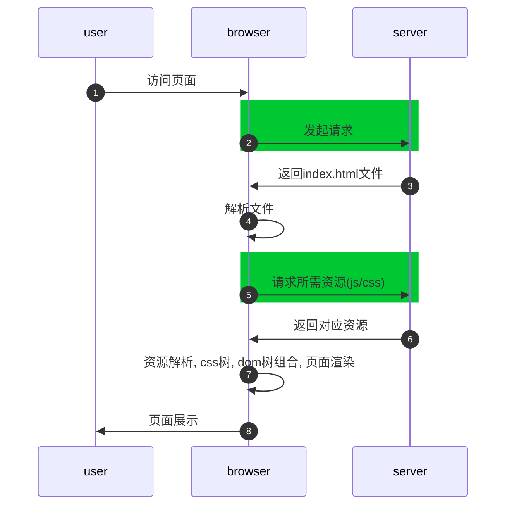
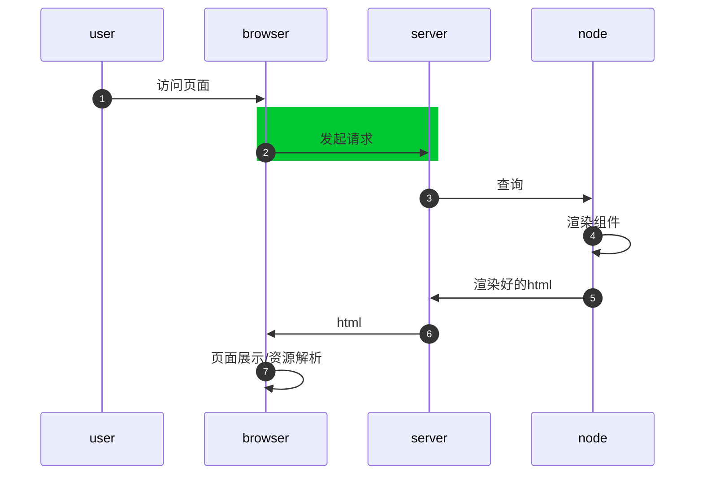
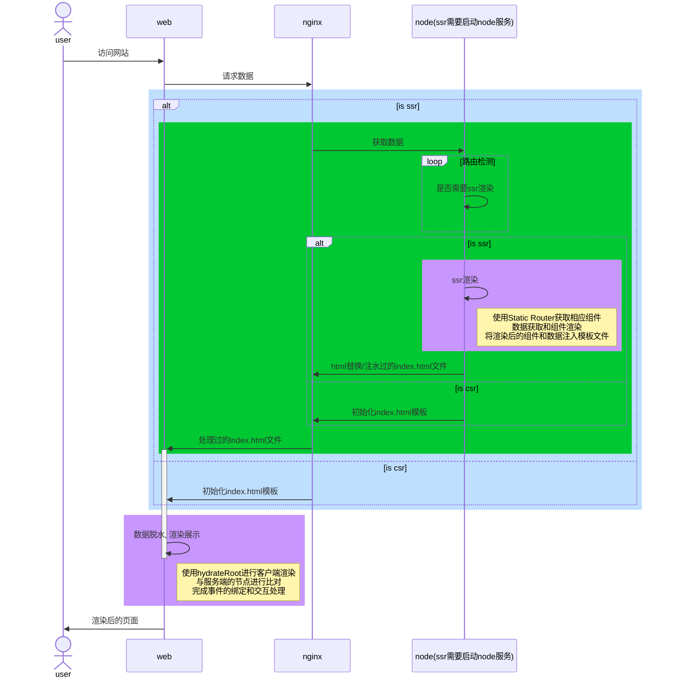

# 同构渲染

> 参考资料:
>
> https://github.com/yacan8/blog/issues/30
>
> https://juejin.cn/post/7196335649728151612
>
> https://cn.vitejs.dev/guide/ssr.html
>
> https://juejin.cn/post/6844903943902855176#heading-1
>
> 公司内部项目实现
>
> https://juejin.cn/post/7145746941366763527


## 1. 基本概念

### 1.1 客户端渲染和服务端渲染的方式和区别

- 两者的渲染方式: 
  - 顾名思义, 客户端渲染是在客户端进行dom的绘制, 基于js代码实现, 主要就是面试时候常背的css树, dom树渲染那一套; 
  - 服务端渲染则是在服务器上(指node服务)根据访问的路由, 获取到相应的页面组件, 然后将组件在服务端组装为html文件, 最后返回给客户端.
- 两者的区别
  - 客户端渲染是目前主流的方式, 其主要优点为:
    - SPA架构, 路由跳转基于js实现, 页面跳转更快
    - 页面渲染工作放在客户端, 减轻了服务端的压力
    - 前后端分离的开发模式, 开发效率更高
  - 服务端渲染的优点为:
    - 同等条件的网络链路下, 服务端渲染的页面白屏时间更短(参考下面流程图)
    - seo友好, 便于提高网站收录率(主要为C端)

- 两者的渲染流程

1. 客户端渲染的主要流程




2. 服务端渲染的主要流程




### 1.2 什么是同构渲染

- 基本概念

  - 相同的代码在客户端和服务端渲染两次

  - 第一次访问页面是服务端渲染，基于第一次访问后续的交互就是 `SPA` 的效果和体验，还不影响`SEO` 效果

- 同构渲染的流程



图片版


## 2. 几个问题

- 服务端渲染组件的方式
  - `Static Route`和普通客户端路由

- 客户端渲染组件的方式
  - `hydrateRoot`和`createRoot`的区别

- 数据的获取/传递
  - 注水和脱水
- 单页面可配置渲染策略
  - 客户端渲染/同构渲染
  - 服务端打包分离样式文件

- 开发调试部署
  - 本地调试
  - `nginx` 和启动的`node`服务关系


## 3. 简单实现

这里有具体repo: https://github.com/scattter/common-utils/tree/main/projects/ssr-study

主要技术框架: `vite + react`, 下面部分代码较多

### 3.1 搭建项目

这里我使用vite进行项目的搭建, 搭建好项目后修改`index.html`模板文件, 便于后续html替换. 替换后的`index.html` 文件如下所示

```html
<!doctype html>
<html lang="en">
  <head>
    <meta charset="UTF-8" />
    <link rel="icon" type="image/svg+xml" href="/vite.svg" />
    <meta name="viewport" content="width=device-width, initial-scale=1.0" />
    <title>Vite + React + TS</title>
  </head>
  <body>
    <div id="root"><!--APP_HTML--></div>
    <script type="module" src="/src/main.tsx"></script>
    <script><!--SSR_DATA--></script>
  </body>
</html>

```

可以看到相比于默认的模板文件, 在`root` 根标签内增加了`<!--APP_HTML--> ` 标识位, 其主要是用于`ssr` 替换; `<script><!--SSR_DATA--></script>` 则是用于注入数据, 具体的下面有详细介绍.


### 3.2 搭建node服务

这里使用`express` 作为`node` 服务, 安装好`express` 后, 在项目的根目录增加`server.js` 文件, 该文件是服务端的执行文件, 具体内容如下

```javascript
import fs from "fs";
import express from "express";
import { SRR_ROUTERS } from "./src/router/routers.js";
const app = express();

// 通过vite创建server服务
const { createServer: createViteServer } = await import("vite");
const isProduction = process.env.NODE_ENV === "production";
const ssrManifest = isProduction
  ? fs.readFileSync("./dist/client/ssr-manifest.json", "utf-8")
  : undefined;

//创建vite服务实例
let vite;
if (!isProduction) {
  // 开发环境下
  vite = await createViteServer({
    server: { middlewareMode: true },
    appType: "custom",
    base: "/",
  });
  // 使用 vite 中间件
  app.use(vite.middlewares);
} else {
  // 生产环境下，设置静态目录
  app.use(express.static("./dist/client"));
}

app.get("*", async (req, res) => {
  const url = req.originalUrl;
  let template;
  let render;

  // 如果是生产环境，直接读取打包后的index.html和server-entry.js
  // 开发环境实时编译
  if (isProduction) {
    template = fs.readFileSync("./dist/client/index.html", "utf-8");
    render = (await import("./dist/server/server-entry.js")).render
  } else {
    template = fs.readFileSync("index.html", "utf8");
    template = await vite.transformIndexHtml(url, template)
    render = (await vite.ssrLoadModule("/src/server-entry.tsx")).render
  }

  if (!SRR_ROUTERS.includes(url)) {
    res.status(200).set({ "Content-Type": "text/html" }).end(template);
    return;
  }

  const { html, data: ssrData } = await render(url);

  if (ssrManifest.url) {
    res.redirect(301, ssrManifest.url);
    return;
  }

  // 给index.html的id为root标签中添加 <!--APP_HTML-->，做为后边要替换的标志
  let responseHtml = template.replace("<!--APP_HTML-->", html);
  res.status(200).set({ "Content-Type": "text/html" }).end(responseHtml);
});
app.listen(5173, () => {});
```

在上面的代码中, 我们首先使用环境变量区分了生产环境和开发环境, 然后根据不同的环境做了不同的配置.

1. 开发环境使用`vite` 中间件, 进行文件的代理; 生产环境直接使用线上打包好的静态文件

   **原因**: 因为我们使用的是`node`启动的项目, 如果想要本地调试, 一些热更新等功能是没有的, 所以需要借助`vite` 来实现, 也即构建一个中间件供`express` 使用; 包括下面获取模板文件, 也是相同的原因

2. 开发环境直接读取项目中的模板文件(使用前需要进行转换)和`render` 函数; 生产环境读取打包后的文件

   `vite.ssrLoadModule` 是在 `Node.js` 环境下加载模块及其依赖，并且在 `Vite `同一个 `Node.js` 环境下执行，并且让这个模块经过` Vite `所有插件 `SSR` 模式转换，让同一份代码在` SSR `模式下也支持` Vite` 提供的语法糖

3. 生产环境需要生成`ssr-manifest.json` 文件

   `ssrManifest`的作用是告知 Node.js 端渲染这个模块下所有的依赖, 可以进行一些预加载的工作(需要在构建客户端资源的命令中配置, 见3.7节, 但是这个文件的具体使用还是不清楚)


### 3.3 服务端渲染

新增服务端渲染入口文件

```javascript
//服务端渲染的入口
import ReactDOMServer from "react-dom/server";
import RootApp from "./ssr/RootApp.tsx";
import App from "./App.tsx";

export function render(url:string) {
  // 获取数据, 可自己配置
  const ssrData = {
    data: {
      url: undefined as string | undefined,
    }
  }
  ssrData.data.url = url === '/home' ? undefined : `ssr render`
  const html = ReactDOMServer.renderToString(
    // 注水
    <RootApp ssr ssrData={ssrData.data} ssrPathname={url}>
      <App />
    </RootApp>
  )
  return {
    html,
    data: ssrData.data
  };
}
```

为什么使用`ReactDOMServer` ?

`ReactDOMServer` 在服务端将 React 组件渲染成静态的（HTML）标签, 然后返回给客户端


### 3.4 客户端渲染

使用`hydrateRoot` 处理路由渲染

使用`SSRProvider` 进行数据脱水

```javascript
import React from 'react'
import ReactDOM from 'react-dom/client'
import App from './App.tsx'
import './index.css'
import {BrowserRouter} from "react-router-dom";
import {SSRProvider} from "./ssr/SSRProvider.tsx";

ReactDOM.hydrateRoot(document.getElementById('root')!,  <BrowserRouter>
  <React.StrictMode>
    <SSRProvider>
      <App />
    </SSRProvider>
  </React.StrictMode>
</BrowserRouter>)
```

为什么使用`hydrateRoot` 而不是`createRoot`

`hydrate()`配合 `SSR` 使用，与`render()`的区别在于**渲染过程中能够复用服务端返回的现有 HTML 节点**，只为其附加交互行为（事件监听等），并不重新创建 `DOM` 节点


### 3.5 数据的注水和脱水

可以看到, 在服务端渲染的入口文件中, 我们将`ssrData` 返回到服务端执行文件中, 在此文件中就可以进行注水, 其和替换`html` 的逻辑一样

```javascript
// 数据脱水
  responseHtml = responseHtml.replace("<!--SSR_DATA-->", `window.ssrData = ${JSON.stringify(ssrData)}`);
```

同时修改模板文件, 增加新的标签

```javascript
<script><!--SSR_DATA--></script>
```

在SSRProvider组件中进行脱水

```javascript
import React, {createContext, useMemo} from "react";

export const SSRContext = createContext<{ ssrData?: any }>({
  ssrData: undefined,
});
SSRContext.displayName = 'SSRContext';

interface ISSRProviderProps {
  ssrData?: any
  children: React.ReactNode | React.ReactNode[]
}
export const SSRProvider: React.FC<ISSRProviderProps> = ({ ssrData, children }) => {
  const value = useMemo(() => {
    // 兼容服务端渲染
    let tempData;
    if (typeof window !== "undefined") {
      tempData = (window as any)?.ssrData ?? ssrData;
    } else {
      tempData = ssrData;
    }
    return {
      ssrData: tempData,
    };
  }, [ssrData]);

  return <SSRContext.Provider value={value}>{children}</SSRContext.Provider>;
}
```

具体的使用

```javascript
import React, {memo} from 'react';
import {useSSR} from "../../../hooks/useSSR.ts";
import './index.css'

export interface IProps {

}

// 服务端和客户端同一套代码, 数据的获取在SSRProvider组件中已经做了兼容处理
const Backend: React.FC<IProps> = () => {
  const { ssrData } = useSSR<{ url: string }>()
  return <div className="backend">this is backend page {ssrData?.url}</div>;
};

export default memo(Backend);
```


### 3.6 单页面配置渲染策略

这里使用了简单的数组来进行过滤判断是否需要服务端渲染

使用`rollup` 的插件来将样式导入代码进行移除, 这里逻辑不是很严谨

```javascript
import { createFilter } from '@rollup/pluginutils';

const RemoveStyle = () => {
  const options = {
    include: ['src/**/*'],
    exclude: [/node_modules/],
  };
  const filter = createFilter(options.include, options.exclude);
  const isSSR = process.argv.includes('--ssr')

  return {
    name: 'RemoveStyle',
    transform(code, id) {
      // 如果不是ssr模式或者不是src目录下的文件，直接返回
      if (!filter(id) || !isSSR) return

      // 删除index.css和index.scss的引入
      const reg = /import\s+["']\.(\/)?index\.(css|scss)["'];/g
      if (reg.test(code)) {
        const source = code.replace(reg, '')
        return {
          code: source,
          // 返回一个空的 sourcemap (这里是移除代码, 不用转换)
          // 如果不想转换代码，则可以通过返回 null 来保留现有的 sourcemap
          map: { mappings: '' }
        }
      }
    },
  }
}

export default RemoveStyle
```


### 3.7 开发调试部署

- 本地调试

```json
"scripts": {
    "server": "npm run build && cross-env NODE_ENV=production node server.js",
    "build": "npm run build:client && npm run build:server",
    "build:client": "tsc && vite build --ssrManifest --outDir dist/client",
    "build:server": "tsc && vite build --outDir dist/server --ssr src/server-entry.tsx",
  }
```

- 线上部署

需要`nginx` 监听相应的端口, 随后转发到服务端的启动端口

一般来讲, `nginx`监听宿主机的`80/443端` 口, 服务端的`node` 启动在`8081` 端口, 那么`nginx` 只需要将根路径`/` 下的请求转发到`8081` 端口即可, `node` 服务进行页面渲染/资源回传


