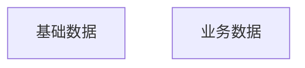
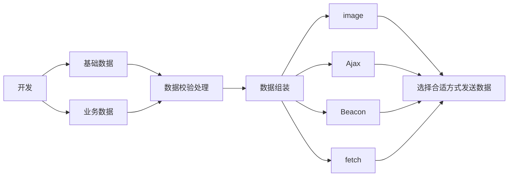

# 前端埋点方案的实现

> 参考资料
>
> [七猫日志接收系统之架构设计（下）](https://tech.qimao.com/qi-mao-ri-zhi-jie-shou-xi-tong-zhi-jia-gou-she-ji-xia/)
>
> [设计数据密集型应用](https://github.com/Vonng/ddia)
>
> [Web 轻量上报数据方式介绍与使用总结](https://juejin.cn/post/7241452578126692413)
>
> https://www.zhihu.com/question/540397795/answer/2550485344


## 背景

在当今这个互联网时代, 最宝贵的财富莫过于数据了. 对于企业来说, 有了足够的数据就可以研发相应的产品, 营销就有了具体的方向, 所有事情的推动也都事半功倍. 对于个人来说也是如此, 拥有更多的数据也就意味着拥有了更多信息, 而信息差的价值永远是最大的. 因此, 数据的获取就成为了关键之步, 本篇文章主要讲企业如何通过前端埋点来获取各种数据, 最后也会捎带一点之前看的服务端数据处理.


## 前端埋点方案

网上现在比较热门的方案有下面几种

- 全埋点
  - 全埋点可以理解为网站有任意操作均会发送相应的信息到服务端, 服务端进行数据处理然后入库, 最后再进行整理, 即完成一次埋点数据收集流程
- 业务埋点
  - 业务埋点主要来源于业务侧, 比如产品/运营想知道这个特性有多少人使用, 使用者的信息等, 这些需要开发在代码中手动编写后发送给服务端, 自由度高, 定制化强.
- 可视化埋点
  - 可视化埋点更多是业务人员来进行操作, 使用的大多数是第三方开发的sdk, 比如产品上线一个活动, 想要知道页面哪些地方点击量比较大, 就可以通过第三方sdk进行整体页面热区分析, 单独按钮/区域圈选.

全埋点一般是公司内部统一方案, 把所有数据进行上报即可, 同时考虑到这里知识点过多, 我了解也不够, 所以本篇主要介绍业务埋点的实现.


## 业务埋点实现

### 1. 相关架构

在设计方案前, 需要确定都需要哪些数据? 虽然是业务埋点, 但是一些基本的数据, 如用户id, 用户浏览器版本等都需要传递给后端. 即我们发送给后端的数据有



其次, 我们在向服务端发送数据前还需要进行数据的前置校验, 数据不完整怎么处理? 基础数据和业务数据是否需要/如何进行组装?

最后就是埋点数据的发送方式, 使用哪种方式发送数据更合适?

因此, 经过上面论述后得到下面的架构(流程)图



### 2. 具体实现

#### 1. 抽象类

由于业务埋点可能会有多种类型, 同时为了方便开发, 使用类的方式实现埋点方案的全链路. 其基类如下所示

```typescript
export abstract class BaseCollectData<T, K> {
  /**
   * 埋点基础数据, 可在子类直接定义也可添加部分逻辑后生成
   */
  protected abstract baseData: K | (() => K);

  /**
   * 发送埋点数据, 如埋点校验和方式选择
   * @param data
   */
  public abstract send(data: T): Promise<void>;

  /**
   * 向服务端发送数据前进行一些逻辑处理
   */
  protected abstract beforeSend(data: T & K): Promise<void>;

  /**
   * 组装基础数据和业务方数据
   */
  protected abstract createDataMessage(data: T): T & K;
}
```

#### 2. 具体类

```typescript
class CollectDataV2<T> extends BaseCollectData<T, IBaseDataV2> {}
```

- baseData

该方法支持传入固定参数, 如当前浏览器的版本, 当前路径等; 同时也支持函数入参, 根据不同的场景动态传入基础数据

- beforeSend

因为该方法需要进行基础数据和业务数据的校验, 所以使用泛型来限制入参的类型, 同时该机制也能提醒使用者传入必传参数, 减少埋点数据丢失的风险.

- createDataMessage

该方法可以在校验数据后, 发送数据前进行数据的一些组装, 比如数据的序列化, 反序列化等.

- send

该方法主要进行数据的发送, 其内使用合适的方法进行通信, 这也是埋点链路中比较重要的一点, 本方案使用`fetch` 方案, 原因见下节.

#### 3. 数据发送方式的选择

在进行埋点方案实现前我一直以为数据的发送就是简单的http请求, 和`CRUD` 没什么不同的, 后来查阅了相关资料才发现里面还是有一些差异的. 埋点请求还需要考虑页面关闭如何把请求发送出去, 页面跳转时也要确保请求的正确发送, 请求不能阻塞主请求, 要低优先级等.

常见的埋点数据发送可选方案包括下面的四种:

1. Ajax
2. Beacon
3. fetch
4. Image

选择`fetch` 的原因是其综合性都比较好, 网上有具体的对比图


同时`fetch` 还支持`keepAlive` 属性, 该属性和`HTTP 1.1`协议里面的`keepAlive` 不是同一个概念, `fetch` 里面的该选项用于指示浏览器**是否应该在页面关闭后保持连接**。大模型 `Gemini` 的建议如下


因此, 后续这里如果有需要的话还要做一些请求的优化.


#### 4. 详细代码

```typescript
export class CollectDataV2<T> extends BaseCollectData<T, IBaseDataV2> {
  /**
   * 默认上传数据
   * @protected
   */
  protected baseData: IBaseDataV2 = {
    location: window.location.href,
    referrer: document.referrer,
    // ...
  };

  /**
   * 发送埋点数据
   * @param originData
   */
  public async send(originData: T & IServerDataV2): Promise<void> {
    const data = this.createDataMessage(originData);
    await this.beforeSend(data);
  }

  /**
   * 默认数据和业务数据组装
   * @param data
   * @protected
   */
  protected createDataMessage(data: T & IServerDataV2) {
    // 将 info 字段转成 json 字符串
    if (data.info) {
      data.info = JSON.stringify(data.info);
    }
    return { ...this.baseData, ...data };
  }

  /**
   * 埋点请求方式选择与埋点校验等前置检查逻辑
   * @param data
   * @protected
   */
  protected async beforeSend(data: T & IServerDataV2 & IBaseDataV2) {
    // 如果数据格式必填项有缺失则不上报数据
    if (!data.key) {
      return;
    }
    // 其他校验逻辑
  }
}
```


### 3. 具体使用

```typescript
const collect = new CollectDataV2();
collect.send({
  moduleName: 'test',
  key: 'micro',
});

const collectWithType = new CollectDataV2<{ path: string }>();
collectWithType.send({
  moduleName: 'test',
  key: 'micro',
  path: 'a path',
});
```


# 总结

上文从埋点的重要性开始, 罗列了三种前端埋点的方式, 并基于日常工作开发对其中的业务埋点做了详细的介绍. 从基类的创建, 子类的实现, 到最后业务方的调用, 每一个阶段都需要考虑不少细节, 而且在真正落地的时候还需要和服务端进行对接和联调, 确保系统能正常运作.

而相比于前端链路, 服务端的处理链路更是冗长, 基于之前看的一些资料, 整理后大概有下面的处理阶段:

1. 数据清洗: 将有用的数据进行抽取出来, 或者是将一些数据进行相应的变体等
2. 数据入库: 埋点数据不同于业务数据, 数量大且繁杂, 所以数据的入库也需要好好设计
3. 数据库管理/检索分析: 不同的数据库有不同的应用场景, 包括数据的持久化
   1. 例如: `clickhouse` 或者 `Prometheus` (两者前者是开源的列式OLAP数据库系统, 后者是开源的服务监控系统和时间序列数据库)

4. 数据推送/消费: 定时推送/处理方案(`Kafka` 之类)
5. ...


从上面的简单描述就可以看到, 想要构建一个前后端都健壮可扩展的系统架构是有多么困难...

