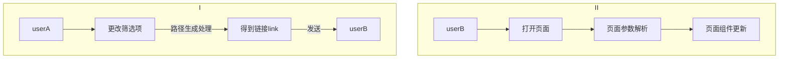

# 前端路由状态保持

## 前言

在日常开发中我们经常会遇到这样一种需求: 用户A在对页面做了一些定制化的筛选后, 将网页链接分享给用户B, 期望用户B打开网页后页面的筛选态保持和A一样, 这就是路由状态保持.

要想实现这一功能, 我们就只能在页面路由链接上做一些处理, 将筛选项这种页面的状态维护在链接中, 用户在访问链接的时候页面对其做一个状态解析和更新, 达到我们期望的效果. 实现这种功能有大致三种方式:

- 参数拼接
  - 这种方式比较直观, 将各种状态直接展示出来, 如 `https://www.xxx.com/?sort=true&tagId=123&category=456` . 
-  字符解析
  - 这种方式就有点黑盒, 路径可能为 `https://www.xxx.com/0-0-0-123-0` , 各个数字/字符的含义只有页面应用自己知道, 所有的逻辑都不外投.

- 短链实现
  - 这种方式是把当前的页面状态编码到一个链接中(十分简短), 然后页面进行一个解析, 相比于上面的路由解析更黑盒, 路由可能是`https://www.xxx.com/dsfjsdf` 这种, 当然也可以借助 `nginx/后端服务` 去做一个路由匹配, 不用页面解析.

本篇文章主要介绍 `字符解析` 部分<span style="color:blue">(`TS`的实现过程为本文重点) </span>, 其中包括一些ts的定义, 推断流程等, 学习高级ts写法, 其次是拓展一些 `锻炼实现` 的相关知识, `参数拼接` 则只做一个简单介绍.

下面就是三种实现方式的详细讲解.


## 2. 参数拼接

这种方式无疑是最直观的, 可读性高,所有的参数均放在连接中, 研发省心, 用户也知道路径里都是什么, 但是这种方式只适合简单的情况. 

试想一下, 如果一个页面有3+ 个筛选项/状态, 那么路径就有可能为 `https://www.xxx.com/?state=hot&color=black&age=18` , 此外, 如果遇到筛选项支持多选的话, 路径的维护更是一个灾难.

这种方式的实现也比较简单, 伪代码如下:



在这个过程中没有很复杂的地方, 唯一要注意的可能就是参数拆分的处理, 比如空态, 错误态等边缘情况的处理, 其他如路径生成就使用固定的参数去进行匹配赋值即可.


## 3. 字符解析

这种方式相比于 `参数拼接` 不太直观, 可读性不高, 解析路径比较复杂, 对于研发有一定的要求, 需要处理好路径解析算法, 但是它的好处也是很大的, 上一节的 `https://www.xxx.com/?state=hot&color=black&age=18` 处理后可能就变成了 `https://www.xxx.com/1-2-3` , 对于可多选的筛选项也能很好的支持, 如 `https://www.xxx.com/1_7-2-3` , 不同筛选项使用 `-` 进行分割, 同一个筛选项的不同状态使用 `_` 进行拼接, 这样很好的解决了链接过长, 筛选项过多的问题.

这种方式的伪代码和 `参数拼接` 也是一样的, 但不同的是字符解析生成更为复杂, 要做不同情况的处理. 而如何解析这些字符, 就是写这篇文章的主要原因. 

我们先从简单的路径解析说起, 以 `https://www.xxx.com/pages/1-1-1-1` 为例.

### 3.1 路径解析

首先, 我们需要将路径中的 `1-1-1-1` 提取出来, 这部分可以维护一个字符/正则数组来实现, 也可以单页面单独进行处理. 如果选择以正则map来进行提取, 我们需要维护一个科学的正则数组, 遍历当前路径, 当匹配到时返回匹配结果, 如果知道最后也没有匹配到, 返回页面丢失或其他兜底逻辑.

```typescript
// 路径匹配解析函数matchPath
// 该函数是react-router内置函数
// Performs pattern matching on a URL pathname and returns information about the match.


// 具体实现
const regs = ['/pages/:searchSegments']
const match = regs.some(reg => {
  return matchPath(reg, window.location.pathname)
});
if (match) {
  const [state = 0, color = 0, age = 0, height = 0] = match.params.searchSegments.split('-')
  // ...做后续业务处理
} else {
  // ...兜底逻辑
}
```

### 3.1 路径生成

除了上面从路径中提取参数, 我们还有另一个比较艰巨的任务: 生成相应路径.

这个任务听起来好像也不是很复杂, 我们只需要做一些路径的拼接就可以了, 但是这是基于 `js` 的前提下, 我们在得到便利性的同时, 也牺牲了可靠性, 所以我们需要借助 `ts` 来定义路径生成类型, 做类型推断, 提高这一过程的可靠性. 下面我们会先以 `js` 为例实现一个简单的路径生成, 然后再使用 `ts` 来生成一个可靠的路径, 最后做一个简单的对比.

#### JS简单处理

首先我们定义路径为: `https://www.xxx.com/[state]-[color]-[age]-[height]`

路径生成

```javascript
const pathname = '1-2-1-2'
let [state = 0, color = 0, age = 0, height = 0] = pathname.split('-')

// 假如更新了state
state = 2
const newPath = [state, color, age, height].join('-')
```

可以看到这种方式也能够实现我们的需求, 虽然可能状态多的时候需要进行许多case的判断, 但如果是只有一个页面, 这就够使用了.  但这样的实现明显不够有保障性, 生成的规则比较随意, 没有统一的约束. 下面看下使用TS实现的效果.


#### TS复杂处理

在这一部分代码比较多, 不但包括一些逻辑生成还有一大部分的类型约束, 整体流程可以分为下面几个步骤:

1. 通过ts进行类型解析
2. 通过schema和对应路径map进行类型约束和确定
3. 通过生成函数进行路径生成

其各步骤对应的代码如下

1. ts类型解析

首先看类型的定义, 这里是组内大佬些的, 我自己觉得是有些复杂, 因为我读起来太难懂了 [捂脸]. 里面一个主要的知识点是ts的`infer` 推断, 这个也比较难懂. 因此我会把一些自己的理解直接放到下面的代码里便于查看.

```typescript
/**
 * 默认允许参数类型
 * 这里就类似于约定 state值的类型, 如state = 0 | '0' ...
 */
type ParamValue = string | number | string[] | number[];

/**
 * 这里首先定义入参泛型 T 只能为字符类型(该类型有很多子类), U默认类型为参数类型
 * 其次使用infer关键字进行类型推断, 在推断的过程中还混杂了字面量类型
 * 也即infer 定义了一个类型Param, 如果T是可选字符, 那么该类型就可以确定为传入字符的可选类型, 否则就原样返回
 * 可以把infer理解为一个函数,
 *  如ExtractRouteOptionalParam<'demo'>, 那么得到的类型就是 { demo: U }
 *  ExtractRouteOptionalParam<'demo?'>, 那么得到的类型就是 { demo?: U }
 */
type ExtractRouteOptionalParam<T extends string, U = ParamValue> = T extends `${infer Param}?`
  ? { [k in Param]?: U }
  : { [k in T]: U };


/**
 * 这里的逻辑和上面类似, 但是对不同的入参做了switch以及递归解析
 * 第一个判断, 如果是可选类型那就全部定义为可选参数
 * 第二个判断, 如果入参类型为 模板字面量[param1]:[param2]/[param3]类型, 则返回ExtractRouteOptionalParam<Param, U> & ExtractRouteParams<Rest, U>
 *   如入参为'home:demo/age' 则ExtractRouteOptionalParam<Param, U> & ExtractRouteParams<Rest, U> = { demo: U }
 * 第三个判断, 如果入参类型为 模板字面量[param1]:[param2]-[param3]类型, 则返回ExtractRouteOptionalParam<Param, U> & ExtractRouteParams<Rest, U>
 *   如入参为'home:demo-age' 则ExtractRouteOptionalParam<Param, U> & ExtractRouteParams<Rest, U> = { demo: U }
 * 最后一个判断, 如果入参类型为 模板字面量[param1]:[param2]类型, 则返回ExtractRouteOptionalParam<Param, U>
 *   如入参为'home:demo-age-color' 则ExtractRouteOptionalParam<Param, U> = { demo: U }
 * 以我们定义的路由 [state]-[color]-[age]-[height]为例
 *   入参为'/home/:state-:color-:age-:height' 最后得到的类型就是 { state: U; color: U; age: U; height: U }
 *   入参为'/home/:state?-:color-:age-:height' 最后得到的类型就是 { state?: U; color: U; age: U; height: U }
 */
type ExtractRouteParams<T extends string, U = ParamValue> = T extends `${infer Key}?`
  ? { [k in Key]?: U }
  : // eslint-disable-next-line @typescript-eslint/no-unused-vars
  T extends `${infer _Start}:${infer Param}/${infer Rest}`
  ? ExtractRouteOptionalParam<Param, U> & ExtractRouteParams<Rest, U>
  : // eslint-disable-next-line @typescript-eslint/no-unused-vars
  T extends `${infer _Start}:${infer Param}-${infer Rest}`
  ? ExtractRouteOptionalParam<Param, U> & ExtractRouteParams<Rest, U>
  : // eslint-disable-next-line @typescript-eslint/no-unused-vars
  T extends `${infer _Start}:${infer Param}`
  ? ExtractRouteOptionalParam<Param, U>
  : {};

/**
 * 上面的类型主要是做公共类型的约束, 本类型将所有的选项配置为可选类型, 同时可以通过泛型ActualParam指定/改变参数的默认类型
 * 以'/home/:state-:color-:age-:height'为例
 *  如果入参为 ExtractRouteOptionalParamWithSchemaPrams<'/home/:state', {}>, 返回为 { state?: ParamValue }
 *  如果入参为 ExtractRouteOptionalParamWithSchemaPrams<'/home/:state', { state: boolean }>, 返回为 { state?: boolean }
 * 可以看到第二个可以改变默认的参数类型
 */
type ExtractRouteOptionalParamWithSchemaPrams<T extends string, ActualParam, SchemaParam = ExtractRouteParams<T>> = {
  [key in keyof SchemaParam]?: key extends keyof ActualParam ? ActualParam[key] : SchemaParam[key];
};
```

2. 通过schema和对应路径map进行类型约束和确定

```typescript
/**
 * 路由模板
 * 定义该路由的参数有open, 有page, 以及他们两个的类型和位置
 */
interface LinkSchema {
  /* 文章详情页 */
  '/home/:state-:color-:age-:height': {
    params: {
      state: string;
      color: string;
      age: number;
      height: number;
    };
  };
}

// 通过该map可以匹配到上面interface内具体的schema参数
const LinkMap = {
  HOME: '/home/:state-:color-:age-:height'
}
```

3. 路径生成函数

```typescript
/**
 * 基于路径生成相应规则
 * 正规规则中兼顾 base的样式处理
 * 暂不考虑解析异常的情况
 * 其中可以对特定的key做页数处理, 如对汉字等字符进行base62编码
 * @param path
 * @param iParams
 */
const generatePath = (path: string, iParams: { [key: string]: ParamValue }) => {
  let params = iParams;
  if (params === void 0) {
    params = {};
  }

  const iPath = path.split('?')[0]!;

  return iPath
    .replace(/:(\w+)/g, (_, key: string) => {
      let value = params[key];
      if (value === undefined) {
        return '0';
      } else if (typeof value === 'number') {
        value = value.toString();
      } else if (Array.isArray(value)) {
        const newValue = value.map((i) => {
          if (isObject(i)) {
            /**
             * 对用 array_object_array风格
             * 只考虑[key: string | number]: number[]风格
             */
            const v = i as { [key: string | number]: number[] };
            const k = Object.keys(v)[0]!;
            return [k, v[k]!.join(',')].join('.');
          }
          return i;
        });

        value = !!newValue.length ? newValue.join('_') : '0';
      }

    	// base62编码, 兼容路径展示
      if (key === 'xxx') {
        value = !!value.length ? base62x.encode(value) : '0';
      }

      return (value as string) ?? '0';
    })
    .replace(/\/*\*$/, (_) => (params['*'] == null ? '' : (params['*'] as string).replace(/^\/*/, '/')));
};

/**
 * @deprecated
 * 给予链接生成
 * 如果当前link在schema中的参数定义和函数形参params的定义匹配, 那么使用形参params的类型
 * 如 genLink('/home/:state-:color-:age-:height', { color: 'black' }) = '/home/0-red-0-0'
 * @param link: 该路由的参数模板, 如'/home/:state-:color-:age-:height'
 * @param params: 生成该路由所需的参数, 如 { color: 'red' }
 * @param query: 也是生成该路由所需的参数, 如 { color: 'red' }
*/
genLink<Link extends keyof LinkSchema>(
    link: Link,
    params: LinkSchema[Link] extends { params: { [key: string]: any } }
      ? ExtractRouteOptionalParamWithSchemaPrams<Link, LinkSchema[Link]['params']>
      : ExtractRouteParams<Link>,
    query?: LinkSchema[Link] extends { query: { [key: string]: any } } ? LinkSchema[Link]['query'] : {}
  ) {
    let pathname = generatePath(link, params as { [key: string]: string });

    const search = qs.stringify(pickBy(query ?? {}));

    if (search) {
      pathname = `${pathname}?${search}`;
    }

    return pathname;
  }
```

具体使用

```typescript
// 具体内容参考上面代码, 这里不在重复写了
const genLink = (link: any, params: any, query?: any) => {}
// 生成链接
const link = genLink(LinkMap.ARTICLE, {state: 1, height: 3})
conole.log(link)	// /home/1-0-0-3
```

可以看到, 使用 `TS` 来进行实现后虽然整体代码多了许多, 逻辑也复杂了许多, 但是也更有保障性了. 开发者只需要定义路由的`schema` 以及对应map即可, 生成路径的时候把最新的参数传进去即可, 类型更有约束性. 如果增加状态, 也是只需要修改固定配置项即可, 而且对于多页面/场景的处理也更有组织性, 相比于 JS 规范不少.

这种实现对于调用者来说心理负担会比较少, 正常配置不会出现问题. 不过出现问题排查起来会比较困难, 因为你首先需要这里的逻辑搞清楚...


## 4. 短链实现

这种实现方式是最黑盒的, 可能分享给其他人的就一段不明所以的链接, 如 `https://07.mmdhjf.t` 这种, 用户打开网站后, `Nginx/后端服务` 会将流量转发到真实地址,  这种更适合于活动页的分享, 不适合用户侧自主分享使用, 因此本文也只是简单提及.

主流的有三种实现方案

- 后端读数据库，后端 302
- Nginx 302
- openresty -> 直接读 redis 302， 如果找不到时去后端


### 4.1 后端302

这里使用 `express` 简单实现下后端的

```javascript
const express = require('express');
const fs = require("node:fs");
const path = require("path");
const app = express();

const FAKE_DB_MAP = {
  '/short': '/long-link'
}

app.get('/', (req, res) => {
  res.end(fs.readFileSync(path.join(__dirname, './origin.html')))
})

app.get('/short', (req, res) => {
  res.writeHead(302, {
    Location: FAKE_DB_MAP['/short'],
  });
  res.end();
})

app.get('/long-link', (req, res) => {
  res.end(fs.readFileSync(path.join(__dirname, './long.html')))
})

app.listen(4000, () => {
  console.log('success')
})
```

实现后的效果为, 访问 `http:localhost:4000/short` 自动跳转到 `http://localhost:4000/long-link`


### 4.2 Nginx 302

- 手动实现

`Nginx` 的实现也比较简单(当然这里只是一个简单的演示, 没有生成算法解析算法, 复杂的重定向要配合lua进行使用)

```
location /short {
	rewrite ^/(.*) http://localhost:4000/long-link redirect;
}
```

- Openresty 实现

这种实现方式也是基于`Nginx` , 但是`Openresty` 比原生的`Nginx` 功能更丰富一些, 可以编写 `Lua` 脚本 + 数据库进行复杂处理, 具体可以参考其官网介绍: `https://openresty.org/en/getting-started.html`

由于短时间没有这个需求, 而且还要下载 `Openresty` 进行配置调试, 所以这里就不叙述了.


## 5. 总结

本文从业务场景出发, 介绍了三种实现状态保持的解决方案, 三种方案各有优略. 在日常的业务开发过程中方案一是最简单的; 方案二如果使用js复杂度容易上手, 使用ts的规范性能得到保障, 但是入手有点难; 至于方案三则更多属于 `企业 -> 用户` 引导点击, 以及活动分享链路.

最重点的内容就是方案二的ts推导, 这种ts的实践方式还是值得学习借鉴的.