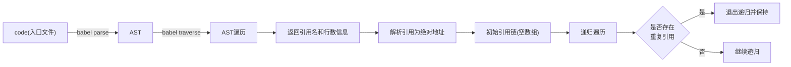

# 基于AST的循环引用检测

> 循环引用的定义:
>
> 如果当前有一个文件`entry.js`, 里面引用了文件`foo.js`, 随后在`foo.js` 里面又引用了`entry.js` . 这就是循环引用, 在`commonjs` 和 `esmodule` 中有不同的标签, 其中前者不支持循环引用, 后者支持但是不推荐(具体危害见下图). 
>
> 在简单的逻辑下一般不会出现循环引用问题, 但是如果需求复杂, 层级嵌套过深就很容易出现不易察觉的循环引用.

为了更好的避免循环引用问题的出现, 我们可以借助`AST` 遍历来进行检测. 其主要的原理就是找到一个文件入口, 随后遍历每一个引用, 生成引用链, 如果引用链中存在当前地址, 即视为有循环引用, 检测成功.


本篇文章内循环检测的主要流程图如下所示:



## 入口文件

这里根据项目的不同有不同的筛选方法, 不过都是用正则表达式等规则去进行寻找.

这里可以使用第三方依赖来进行简单的入口路径查找

```javascript
// 查找入口
const files = await glob(`${workspace}/**/entry.js`, {
  ignore: ['**/node_modules/**'],
})
```


## AST解析与遍历

这里主要用到了`babel` 的插件来进行`AST` 解析, 解析出来为`Estree` 规则, 这里还有另一个`Acorn` 规则, 不过这两个都差不多.

这里解析后直接进行遍历, 主要是对`import specifiers from source` 类型的引用进行处理, 保存引用的`module` 以及具体的行数信息, 当然也有针对其他引用的规则处理, 如`CallExpression` 针对`import('module')` 和 `require('module')` ; `ExportAllDeclaration` 针对 `export \* from source` 

```javascript
const parseFile = (code) => {
  const moduleNameSet = new Set()
  // 解析文件
  const ast = parse(code, {
    sourceType: 'module',
  })
  // 遍历文件, 获取引用名和行数信息
  traverse(ast, {
    ImportDeclaration(path) {
      moduleNameSet.add({
        moduleName: path.node.source.value,
        line: path.node.loc.start.line ?? 1,
      })
    }
  })
  return moduleNameSet
}
```


## 解析绝对地址

这里根据项目的不同有不同的处理, 如果不想处理`nodejs` 类型, 那么可以直接忽略; 如果项目里面配置了`Alias` , 那么需要处理下别名, 使用真实地址进行替换(这里需要去读取配置文件获取别名配置); 如果是相对引用, 那么就处理下相对引用即可.

在这个文档里面就简单的对相对引用处理下

```javascript
/**
 * 获取依赖的绝对地址
 * @param moduleName: 依赖(如'./xx.js')
 * @param sourceFile: 源文件(如'entry.js')
 * @returns {string}: 绝对地址(如'/Users/xx/project-1/xx.js')
 */
const getOriginPath = (moduleName, sourceFile) => {
  // 相对径路文件
  const dir = path.dirname(sourceFile.moduleName);
  return path.resolve(dir, moduleName);
}
```


## 递归遍历检测

在上述对引用地址处理完毕后就可以对其进行递归检测了. 

```javascript
/**
 * 递归查找循环依赖
 * @param file: 入口文件
 * @param chain: 依赖链(包含当前文件)
 * @returns {void}: 当找到循环依赖时, 会将依赖链存入callerChain, 退出循环
 */
const findCycleModule = async (file, chain) => {
  const {moduleName, line} = file
  const pureChain = chain.map((item) => item.moduleName)
  if (pureChain.includes(moduleName)) {
    callerChain.set(moduleName, [...chain, file])
    return
  }

  if (callerChain && callerChain.has(moduleName)) {
    return
  }

  // 这个变量是处理完的绝对引用地址
  const originPath = new Set()
  // 省略掉其他处理
  // ...

  // 递归到当前文件内部, 查找循环依赖
  // 递归时初始文件行数要更改为当前module的行数
  for (const cFile of originPath) {
    await findCycleModule(cFile, [...chain, {
      moduleName: file.moduleName,
      line: cFile.line,
    }])
  }
}
```

可以看到, 递归停止的条件就是

1. 发现当前引用链上引用过当前引用
1. 全局变量(保存所有的循环引用)存在当前检测
1. 当前文件没有引用其他文件了

当遍历结束后, `callerChain` 里面就是保存的所有循环引用信息


## 打印循环引用信息

这一部分就比较简单了, 根据自己的需要进行数据处理即可

```javascript
// 打印循环依赖信息
for (const [key, value] of callerChain) {
  console.log('循环依赖存在于文件: ', key)
  console.log('依赖链: ')
  value.forEach((item) => {
    console.log(`---> ${item.moduleName}: ${item.line}`)
  })
  console.log('\n')
}
```

控制台如下所示


## 总结

当然, 如果把这个功能做成一个`cli` 的话肯定是需要考虑更多细节的, 同时也需要引入一些新的依赖进行命令行的交互, 这一部分可以在完善的时候进行添加, 使其能够真正落地.

最后, 感谢组内同事, 正是组内工具的源代码才让我又了解到不少相关知识.