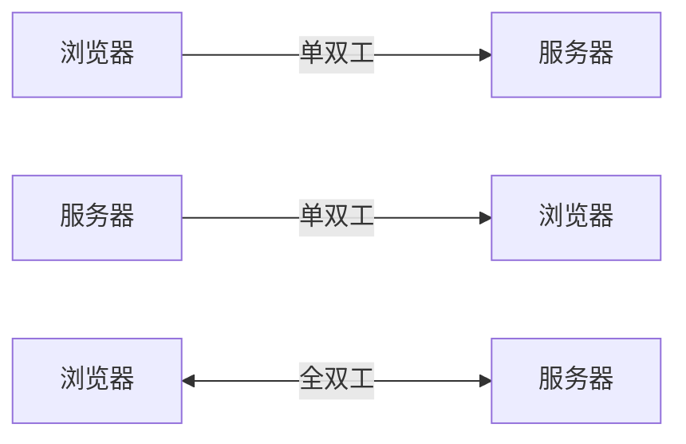
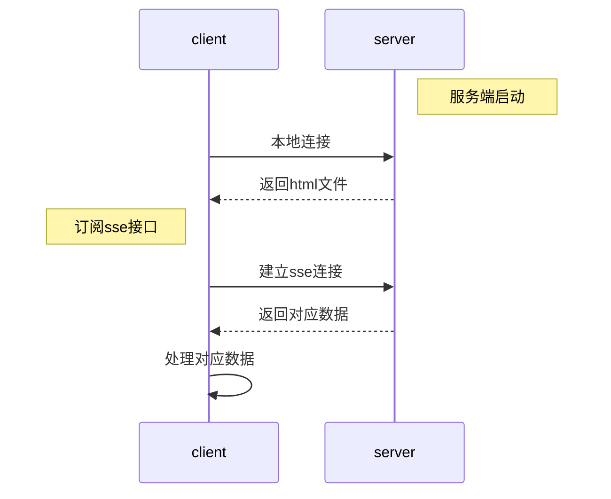
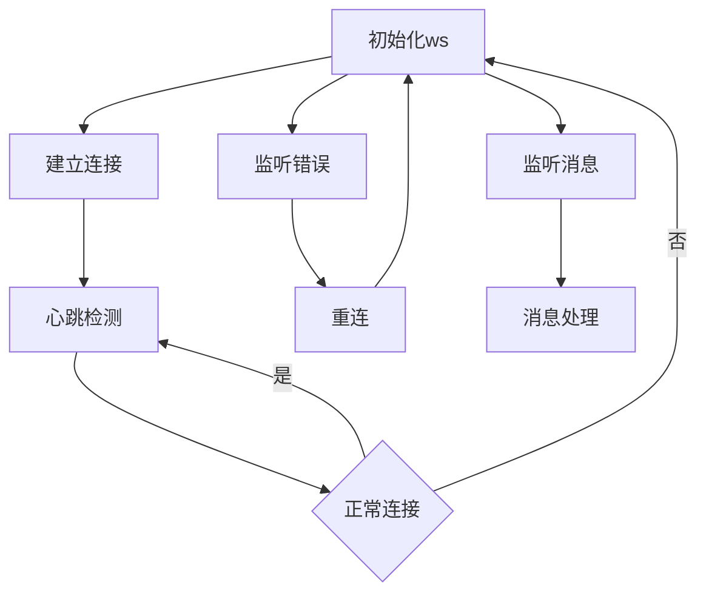

# 浏览器和服务器间通信

> https://halfrost.com/websocket/
>
> https://juejin.cn/post/7005834488529813511
>
> https://developer.mozilla.org/zh-CN/docs/Web/API/Server-sent_events/Using_server-sent_events
>
> https://blog.q-bit.me/how-to-use-Nodejs-for-server-sent-events-sse/#h4-1
>
> https://zhuanlan.zhihu.com/p/591721692
>
> https://socket.io/docs/v4/

> 因为工作和中间看其他资料, 前前后后一个月终于把这篇文章更新上了

本篇文章主要讲述客户端(主要是浏览器)和服务器通信的三种方式:

1. 浏览器单向请求, 获取到服务器响应后渲染到页面或不做任何操作
2. 服务端单向发送信息到浏览器, 浏览器被动接受信息, 进而渲染或者不做任何操作
3. 浏览器和服务端可以双向响应, 即浏览器发送给服务端, 服务端也可以发送给客户端




## 1. 浏览器单向请求

我们日常生活中见到的大部分页面/应用都是这种, 即客户端发起请求, 服务端响应, 客户端对数据进行处理后呈现给用户.

以`web` 端为例, 这一部分主要使用`HTTP` 请求进行数据获取, 底层的api为`fetch` 或者`HTTP` . 由于底层api提供的功能较为基础, 所以出现了`axios` 这种开源项目. 使用`axios` 可以很方便的对客户端请求和服务端响应进行拦截, 做一些鉴权, 数据处理, 请求头设置, 错误响应等操作.

还有一部分使用`UDP` 协议来进行数据的传输, `UDP` 的好处是传输速度快, 但是数据不可靠, 所以一般都是用于视频流的传送, 这部分就暂时不探索了.

在具体的`HTTP` 版本上, 有`HTTP/1`, `HTTP/1.1` , `HTTP/2` 以及制定中的`HTTP/3`

他们之间简化的网络分层结构如下所示

应用层       HTTP / HTTP/2 / HTTP/3 

传输层       UDP / TCP 

网络层       IP 

链路层       以太网、Wi-Fi等物理硬件

由于`HTTP 3` 还没大面积铺开, 简单搜索了下发现网上资料不多, 学习需要一定的成本, 因此这里暂时就先不研究了.


### HTTP/1.0

其特性包括

- HTTP/1.0 是最早的 HTTP 协议版本，于1996年发布。
- 它使用简单的请求-响应模型，每个请求需要单独建立一个 TCP 连接。
- 不支持管道化（pipelining），即在发送请求后等待响应之前只能发送下一个请求。
- 不支持持久连接（keep-alive），每个请求/响应都需要建立和关闭连接。
- 不支持请求头部压缩，每个请求和响应都以完整的形式传输。


### HTTP/1.1

- HTTP/1.1 是目前最广泛使用的 HTTP 版本，于1999年发布。
- 引入了持久连接（keep-alive），使得多个请求和响应可以在同一个连接上复用，减少了建立和关闭连接的开销。
- 支持管道化（pipelining），允许客户端在等待之前发送多个请求，提高了请求的并发处理能力。
- 引入了请求头部压缩（通过类似于 HPACK 的方法），减少了请求和响应的传输大小。
- 引入了分块传输编码（chunked transfer encoding），使得服务器可以分块发送响应，提高了大文件传输的效率。
- 支持虚拟主机（Virtual Hosting），多个域名可以通过同一个 IP 地址共享。


### HTTP/2

`HTTP/2` 的新特性:

1. **多路复用（Multiplexing）**：支持同时在单个 TCP 连接上发送多个请求和响应，这意味着可以并发发送多个请求，而不需要等待上一个请求完成。这样可以提高网络利用率和性能。
2. **二进制分帧（Binary Framing）**：使用二进制格式对数据进行分帧传输，取代了 HTTP/1.x 中的文本格式，例如请求头和响应头。这样做提高了解析效率，使得协议更加高效。
3. **流（Stream）和优先级（Priority）**：将请求和响应消息划分为多个流，每个流可以独立处理。流可以根据优先级进行排队，确保重要的资源优先加载。此外，通过流的取消或拒绝可以有效地控制资源的使用。
4. **头部压缩（Header Compression）**：使用 HPACK 算法(使用静态/动态字典表进行数据的缓存, 涉及到请求/响应时的编解码)对请求和响应头进行压缩。相对于 HTTP/1.x 中每次请求都需要重复发送相同的头部信息，头部压缩可以显著减少数据传输量，节省带宽和降低延迟。
5. **服务器推送（Server Push）** :  允许服务器在客户端请求前主动推送相关资源。服务器可以根据请求的 HTML 页面解析，主动推送页面所需的附加资源，以提高页面加载速度。

在上面的新特性中, **服务器推送比较鸡肋, 其效果不好, 也没有浏览器支持**. 谷歌不再支持的公告: https://developer.chrome.com/blog/removing-push/ . 其他的新特性都从特定方面优化了网络连接体验, 包括`TCP冷启动` 这类问题.

因为大多数人(包括我自己)对该版本了解过少, 所以下面基于`Nodejs` 实现一个简单的`HTTP/2` 服务, 测试下多路复用和头部压缩的效果, 其他的两个就暂时先不测了.

:::tip

由于`HTTP/2` 要求使用加密传输, 因此需要自己准备一个证书, 可以自签, 也可以从[免费网站](https://letsencrypt.osfipin.com/)上申请.

:::

1. 基于`HTTP/2` 的例子

```js
const http2 = require('node:http2');
const fs = require('node:fs');
const path = require("path");

const server = http2.createSecureServer({
  key: fs.readFileSync(path.join(__dirname, './public/key.pem')),
  cert: fs.readFileSync(path.join(__dirname, './public/cert.pem')),
});
server.on('error', (err) => console.error(err));

server.on('stream', (stream, headers) => {
  // stream is a Duplex
  stream.respond({
    'content-type': 'text/html; charset=utf-8',
    ':status': 200,
  });
  if (headers[':path'] === '/about') {
    // 处理 /about 路由的逻辑
    stream.end('success');
  } else {
    stream.end(fs.readFileSync(path.join(__dirname, './public/http2.html')));
  }
});

server.listen(3000)
```

`HTML`

```html
<!doctype html>
<html lang="en">
<head>
  <meta charset="UTF-8">
  <meta name="viewport"
        content="width=device-width, user-scalable=no, initial-scale=1.0, maximum-scale=1.0, minimum-scale=1.0">
  <meta http-equiv="X-UA-Compatible" content="ie=edge">
  <title>Document</title>
</head>
<body>
<h1>HTTP/2</h1>
<div class="backend"></div>
</body>
<script>
  // 1000次循环请求
  for (let i = 0; i < 1000; i++) {
    fetch('/about')
  }
</script>
</html>
```


- 多路复用对比

`HTTP/2` 请求时间如下


对应的`HTTP/1.1` 请求时间如下


- 头部压缩对比

基于`HTTP/2` 的请求头


基于`HTTP/1.1` 的请求头


2. 基于`spdy` 的简单例子

```javascript
const express = require('express');
const spdy = require('spdy');
const fs = require('fs');
const path = require('path');
const app = express();

app.get("/", async (req, res) => {
  try {
    res.end(fs.readFileSync(path.join(__dirname, './public/http2.html')))
  }catch(error){
    res.status(500).send(error.toString())
  }
})

spdy.createServer(
  {
    key: fs.readFileSync(path.join(__dirname, './public/key.pem')),
    cert: fs.readFileSync(path.join(__dirname, './public/cert.pem'))
  },
  app
).listen(3000, (err) => {
  if(err){
    throw new Error(err)
  }
  console.log("Listening on port 3000")
})
```


## 2. 服务端单向推送

此处主要指的是`SSE` , 即`Server send event` . 服务端可以主动向客户端推送消息, 但是客户端不能向服务端推送消息, 类似的应用场景包括如股票, 服务器占用率等服务端实时数据推送. 除此之外, `SSE` 原生支持断开重连, 重连的间隔可能是依据服务端的`retry` 字段, 也可能是根据不同浏览器做调整.

这里使用`node` 实现简单的服务端推送

:::tip

SSE可以自定义发送的事件名称, 便于客户端进行不同的处理, 下面的例子中使用的是简单的`message` 和 `connected` 事件

:::

服务端代码

```javascript
const express = require('express')
const {getAllInfo} = require("./info");

const app = express()

// app.use(express.static('public'));
// 发送html文件
app.get('/', (req, res) => {
  res.sendFile('./public/index.html', { root: __dirname });
})
// sse推送内容
app.get('/subscribe', (req, res) => {
  res.writeHead(200, {
    'Content-Type': 'text/event-stream',
     Connection: 'keep-alive',
    'Cache-Control': 'no-cache',
  });

  let counter = 0;

  // Send a message on connection
  res.write('event: connected\n');
  res.write(`data: You are now subscribed!\n`);
  res.write(`id: ${counter}\n\n`);
  counter += 1;

  // Send a subsequent message every five seconds
  setInterval(() => {
    const info = getAllInfo();
    res.write('event: message\n');
    res.write(`data: ${info.usage}\n`);
    res.write(`id: ${counter}\n\n`);
    counter += 1;
  }, 5000);

  // Close the connection when the client disconnects
  req.on('close', () => res.end('OK'))
});

app.listen(3000, () => {
    console.log('server start')
})
```

在上面代码中, 首先是使用`express` 建立了一个后端服务, 监听`3000` 端口, 随后增加路由, 对于根路由返回`html` 文件, 对于`sse` 路由设置响应头和响应数据, 通过`setInterval` 每五秒发送次服务器占用信息给客户端.

`HTML` 代码

```html
<!doctype html>
<html lang="en">
<head>
  <meta charset="UTF-8">
  <meta name="viewport"
        content="width=device-width, user-scalable=no, initial-scale=1.0, maximum-scale=1.0, minimum-scale=1.0">
  <meta http-equiv="X-UA-Compatible" content="ie=edge">
  <title>Document</title>
</head>
<body>
<h2>server send event</h2>
<div class="backend"></div>
<ul></ul>
</body>
<script>
  const ele = document.querySelector('.backend')
  const ul = document.querySelector('ul')
  const eventSource = new EventSource('/subscribe')
  eventSource.addEventListener('connected', (e) => {
    ele.innerText = e.data
  })
  eventSource.addEventListener('open', (e) => {
    console.log('open', e)
  })
  eventSource.addEventListener('message', (e) => {
    const listItem = document.createElement('li');

    listItem.innerText = event.data;
    ul.append(listItem)
  })
  eventSource.addEventListener('error', (e) => {
    console.log('error', e)
  })
</script>
</html>
```

此处主要是`sse` 的前端展示, 加载该文件时通过`new EventSource('/subscribe')` 订阅服务端的`sse` 接口, 将获得的数据在前端进行渲染展示.


整理后, 上面的交互逻辑如下所示




## 3. 浏览器和服务端双向推送

此处主要指的是`WebSocket` , 通过该协议客户端和服务端可以互相通信, 实现如在线聊天室的功能.

`WebSocket` 对外暴漏的方法比较简单, 只有`send` 和 `close` 两个方法, 用于发送信息和关闭连接.

除此之外, 还有一个`on` 接口用来监听相应事件:

- `open` 事件：当连接建立时触发。
- `message` 事件：当接收到来自服务器的消息时触发。可以通过监听该事件来处理服务器发送的数据。
- `error` 事件：当发生错误时触发。
- `close` 事件：当连接关闭时触发。

下面是原生`WebSocket` 和第三方库`WebSocket` 的demo


### 原生`WebSocket`

#### 服务端

```javascript
const ws = new require('ws')
const fs = require('fs')
const http = require('http')
const wss = new ws.Server({ noServer: true })

const clients = new Set()
const server = http.createServer((req, res) => {
  if (req.url === '/ws') {
    res.end(fs.readFileSync('./index.html'))
  } else {
    res.end('hello')
  }
})

server.on('upgrade', (req, socket, head) => {
  wss.handleUpgrade(req, socket, head, onConnect);
});

server.listen(8080)
function onConnect(ws, req) {
  clients.add(ws)
  ws.on('message', (message, isBinary) => {
    // use isBinary to confirm message type
    const receiveData = isBinary ? message : message.toString()
    // 广播给所有非自身的客户端
    if (receiveData !== 'ping') {
      for (let client of clients) {
        ws !== client && client.send(`${req.socket.remotePort}: ${receiveData}`)
      }
    }
    setTimeout(() => {
      if (receiveData !== 'ping') {
        for (let client of clients) {
          client.readyState === 1 && client.send('pang')
        }
      }
    }, 1000)
  })
  ws.on('close', () => {
    clients.delete(ws)
  })
}
```

通过 `new ws.Server({ noServer: true })` 的方式创建一个 WebSocket 服务器实例, 但并不立即绑定到任何 HTTP 服务器上。这里的 `noServer: true` 选项告诉 `ws` 模块不要直接创建一个 HTTP 服务器，而是等待手动将其绑定到现有的 HTTP 服务器上。这样就可以更灵活地控制 WebSocket 服务器和 HTTP 服务器之间的交互。

在创建一个 HTTP 服务器后，将它作为参数传递给 `wss`（WebSocket 服务器实例）的 `handleUpgrade` 方法，以便处理来自客户端的升级请求并建立 WebSocket 连接.

```js
server.on('upgrade', (req, socket, head) => {
    wss.handleUpgrade(req, socket, head, onConnect);
});
```

在这里服务器监听连接升级事件, 如果出现连接升级, 那么就交给`WebSocke `处理, 也即 `handleUpgrade` 方法, 其各参数分别表示

1. `req`：表示客户端发起的升级请求的 HTTP 请求对象。它包含了来自客户端的请求信息，例如头部、URL 等。
2. `socket`：表示与客户端之间建立的原始 TCP socket 连接。
3. `head`：表示客户端发送的初始数据，通常是 HTTP 协议的升级握手请求。
4. `onConnect`：这是一个回调函数，用于处理升级成功后的 WebSocket 连接。在这个回调函数内，你可以进行一些自定义的逻辑，比如对 WebSocket 连接进行认证、注册事件处理程序等操作。

在某些非标准的应用场景下，客户端可能根据自己的需要在升级请求中携带一些特定的信息或 Token，服务器端就需要根据这些额外的数据来进行认证或授权等操作, 此时，`head` 的值就会变得非常重要, 其他时间就无所谓了.

在`onConnect` 这个函数中, 实现了接入客户端的存储, 信息的转发, 以及客户端断开连接后的处理. 同时做了简单的心跳检测, 告知客户端服务端是否在线(心跳检测, 重连的主要逻辑在下面的`index.html` 中)以及消息的广播.

当然, 这里对于消息的广播很粗糙, 不能保留每个连接的状态, 发送的消息也不会保存起来, 下一章节使用`Socket.io` 进行demo.


前端页面`index.html` 

```html
<!doctype html>
<html lang="en">
<head>
  <meta charset="UTF-8">
  <meta name="viewport"
        content="width=device-width, user-scalable=no, initial-scale=1.0, maximum-scale=1.0, minimum-scale=1.0">
  <meta http-equiv="X-UA-Compatible" content="ie=edge">
  <title>Document</title>
</head>
<body>
<div>
  <h1>web-socket study</h1>
  <label>
    <input type="text">
  </label>
  <button class="send">send</button>
  <div id="messages"></div>
</div>
</body>
<style>
  #messages {
    display: flex;
    justify-content: flex-end;
    flex-direction: column;
    width: 80vw;
    height: 70vh;
    overflow-y: scroll;
    background-color: antiquewhite;
    margin-top: 20px;
    padding: 10px;
  }
</style>
<script>
  // 心跳间隔, 重连间隔
  const HEART_TIME = 3000, RECONNECT_TIME = 3000
  let heartTimer = null
  
  const inputValue = ''
  const inputEle = document.querySelector('input')
  const sendEle = document.querySelector('.send')
  const messagesEle = document.querySelector('#messages')
  
  function webSocketInit(service) {
    const ws = new WebSocket(service)
    ws.onopen = () => {
      console.log('open')
      heartCheck()
    }
    ws.onmessage = (e) => {
      e.data !== 'pang' && prependEle(e.data, 'server')
    }
    ws.onerror = (e) => {
      console.log('error', e)
      reConnect()
    }
    
    function close() {
      console.log('close')
      ws.close()
    }

    function reConnect() {
      setTimeout(function(){
        webSocketInit(service);
      }, RECONNECT_TIME);
    }

    function heartCheck() {
      heartTimer = setInterval(() => {
        if (ws.readyState !== 1) {
          clearInterval(heartTimer)
          webSocketInit(service)
        } else {
          ws.send('ping')
        }
      }, HEART_TIME)
    }
    
    return ws
  }

  const ws= webSocketInit('ws://localhost:8080')
  
  sendEle.addEventListener('click', () => {
    const inputValue = inputEle.value
    prependEle(inputValue, 'client')
    // reset input value
    inputEle.value = ''
    ws.send(inputValue)
  })

  function prependEle(data, source) {
    const msgEle = document.createElement('div')
    msgEle.style = `align-self: ${source === 'client' ? 'flex-end' : 'flex-start'}`
    msgEle.textContent = source === 'client' ? data + ' :client' : data
    messagesEle.appendChild(msgEle)
  }
</script>
</html>
```

在前端页面主要的流程为:



最后, 我们使用这套代码启动后, 互相发送消息后的效果如下所示(55423和55440是浏览器建立连接的端口号):


### Socket.io实现Websocket

> https://socket.io/docs/v4/
>
> Socket.IO is a library that enables **low-latency**, **bidirectional** and **event-based** communication between a client and a server.

在官网上, `socket.io` 介绍自己是一个低功耗的双向通信依赖库. 其支持`HTTP long-polling` (长轮询)和`WebSocket` , `WebTransport` , 并在连接的过程中根据浏览器支持情况和网络情况自动选择. 

在

`socket.io` 在服务端安装后, 有两种不同的挂载使用方式(本次测试使用第二种方式)

- 自身作为`HTTP` 服务器使用
- 基于其他第三方`HTTP` 服务器(如`express`)来使用

在客户端, `socket.io` 可以通过下载`NPM` 包, 可以使用`CDN` , 本地文件, 也可以从服务端获取, 本地使用服务端获取的方式. 具体代码如下

服务端代码

```js
import express from 'express';
import { Server } from 'socket.io';
import http from 'http';

const app = express();
const server = http.createServer(app);
const io = new Server(server);

app.get('/', (req, res) => {
  res.sendFile(new URL('./index.html', import.meta.url).pathname);
})

io.on('connection', (socket) => {
  console.log('a user connected', socket.id);
  socket.on('send', (msg) => {
    socket.broadcast.emit('receiver', `客户端${socket.id}说: ${msg}`)
  })
})

server.listen(3000, () => {
  console.log('listening on *:3000');
})
```

可以看到, 相比于原生的`WebSocket` 实现, 该种方式的代码十分简洁, `socket.io` 内部封装的一些API十分方便高效.

- `on` 方法监听事件, 包括内置事件`connection` 和自定义事件`send`
- `emit` 方法发送具体事件, 包括内置事件`connection`和自定义事件`receiver`
- `broadcast` 方法广播当前事件, 和`emit` 方法的区别是此方法不发送给自己
- ...其他还有许多方法, 可以有需要的时候去官网上查阅

客户端代码

```html
<!doctype html>
<html lang="en">
<head>
  <meta charset="UTF-8">
  <meta name="viewport"
        content="width=device-width, user-scalable=no, initial-scale=1.0, maximum-scale=1.0, minimum-scale=1.0">
  <meta http-equiv="X-UA-Compatible" content="ie=edge">
  <title>Document</title>
</head>
<body>
<h1>hello</h1>
<input type="text">
<button>send</button>
<ul></ul>
</body>
<script src="/socket.io/socket.io.js"></script>
<script>
  const socket = io()
  const button = document.querySelector('button')
  const input = document.querySelector('input')
  const ul = document.querySelector('ul')
  button.addEventListener('click', () => {
    const li = document.createElement('li')
    li.textContent = '我说: ' + input.value
    ul.append(li)
    socket.emit('send', input.value)
    input.value = ''
  })
  
  socket.on('receiver', (msg) => {
    const li = document.createElement('li')
    li.textContent = msg
    ul.append(li)
  })
</script>
</html>
```

此处的逻辑和之前逻辑类似, 就不在赘述了.

实现的效果为:


