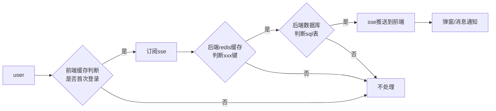

# 处理主题包切换主题时的多余刷新

## 背景

在公司的业务中, 对于每日首次登录网站的用户或者符合特定条件的用户, 产品会对其进行定制化消息推送, 以实现精准投送的目的. 具体原理就是用户在每日的首次登录后, 后端会通过sse推送具体的营销信息到前端, 前端获取到相应的信息后再通过弹窗或者提示呈现给用户.

但是在业务端发展过程中, 发现之前的单弹窗推送模式已经不能够满足现有的业务场景了, 因此接续弹窗(多弹窗)的需求就这样诞生了.


## 具体实现

这里先说下每日推送的主要判断逻辑



具体的代码落地上, 由于许多弹窗类型是一样, 如两个活动都是使用`Dialog` 组件来进行展示信息, 页面同时出现两个弹窗肯定要确定各自的层级, 否则容易出现顺序混乱的问题. 

当然, 这里的实现比较简单. 首先定义一个基础的层级值 `INIT_INDEX` , 拿到推送信息后在该基础值上逐次递增即可.


## 异常定位

到这里一切都比较顺利, 然后异常情况就来了.

在业务上有一种推送形式是 `Notification` 类型, 如果配置了多个该类型的推送, `Notification` 提醒会出现一闪而逝的情况, 甚至是完全不展示, 但是有时候又比较正常. 这种情况就比较诡异, 开始猜测是不是哪里代码写得有问题, 触发了组件的销毁. 后来就进行代码排查, 和所有异常问题一样, 无果...

正好当时周五, 所以周末两天就在家debugger看了一下, 发现了下面的代码

由于代码中弹窗类型的组件外层都有`ThemeProvider` 包裹, 所以每一个组件都会受到该组件副作用的影响, 即如果有其他地方(如微应用) 中存在主题更换的问题, `toast` , `notification` , `Dialog` 组件都会调用自身的config方法进行样式重置.


具体到`notification` 组件上, 其`config` 方法(76行) 会调用63行的`destory` 方法. 该方法会销毁上一次渲染的组件, 至此, 该异常的问题已经定位到了.


## 问题解决

由于问题是由于主题切换造成的, 那么第一个想法就是不去切换主题, 所以就排查现有项目中的`ThemeProvider` 组件.在经过一番替换后, 再次重试, 发现问题还是没有解决, 同时因为我们的项目是基于微应用实现的, 一个页面可能有4, 5个微应用组成, 全部更换是不可能的事情(而且业务逻辑什么的都不清楚了). 所以就卡在这里了.

由于一直想不到解决的方法, 就去问了组内同事, 遂有了下面的解法: 劫持`notification` 的 `config` 方法.

组件销毁的原因是调用了组件的`config` 方法, 该方法内部调用了销毁的api, 如果把该方法劫持, 做一层缓存, 当第二次执行组件销毁的时候直接`return` 那么就可以解决这个自动销毁的问题(第一次执行销毁是在页面初始化加载时). 

具体如下:

```typescript
export const useProxyTheme = () => {
  useInsertionEffect(() => {
    let hasConfig = false;
    const originConfigFn = notification.config;
    notification.config = function (param: Parameters<typeof originConfigFn>[0]) {
      if (hasConfig) {
        return;
      }
      hasConfig = true;
      originConfigFn.apply(this, [param]);
    };

    return () => {
      notification.config = originConfigFn;
    };
  }, []);
};
```

即允许页面加载后的首次缓存, 但是对后续的触发直接进行返回, 减少多余的触发.

如果后面需要对特殊的theme或者其他case进行处理, 也可以在这里添加代码, 不用修改其他地方.


这里能劫持的原因是因为第七行代码, 使用`originConfigFn` 改变了方法的指向. 打包后的文件内容是固定的, 即a触发b, b是固定的, 如果用一个新的变量c改变b的指向, 

那么a触发b相当于a触发新变量c, 执行c方法. 这样也就是劫持了config方法.

