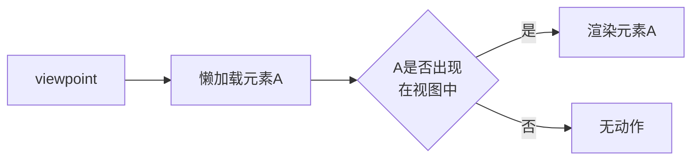
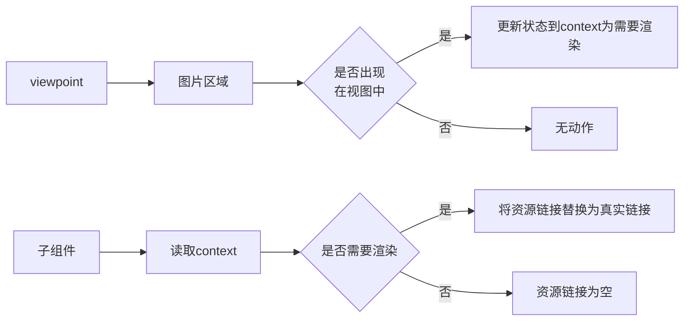
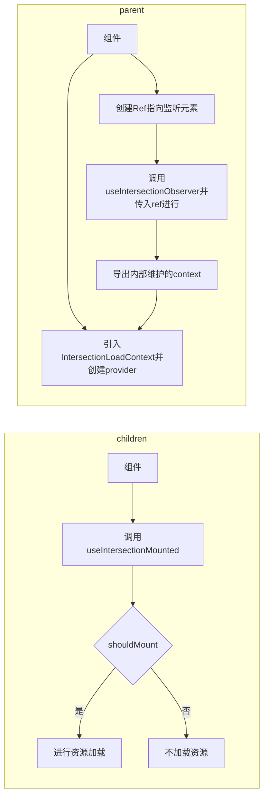
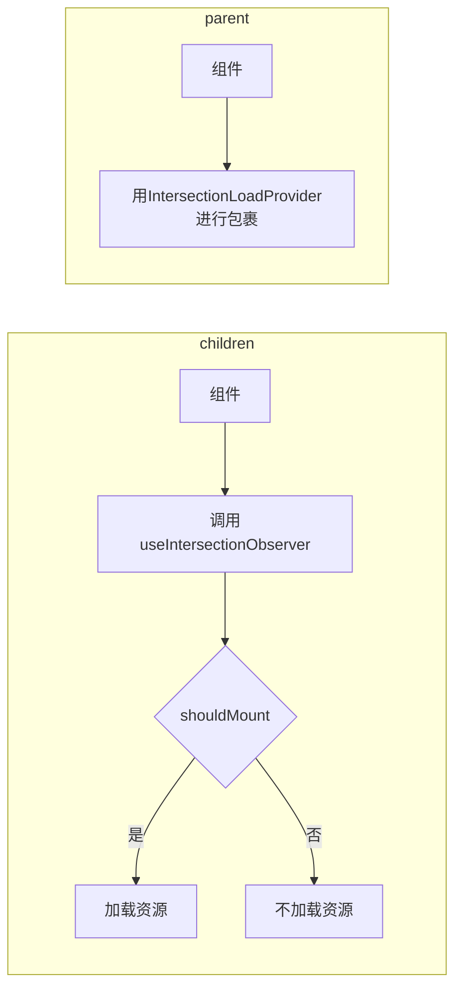

# 首页图片资源懒加载优化

## 背景

对于以素材/图片为资源的网站首页来说, 有许多非首屏的图片大概率是用户看不到的. 如果首次进入页面就加载所有的资源, 那无疑会拖累首屏的渲染速度, 对用户体验造成不好的影响, 因此我们需要首页内容进行懒加载.

懒加载的方式有许多, 如

- 虚拟列表, 滑动到具体地方再进行请求资源
- 懒加载, 也是页面滑动到具体地方再进行组件的渲染
- ...

但是, 如果网站首页还有seo需求的话, 上面的懒加载方式就不适用了.

我们需要将文本等便于爬虫获取的信息放到首页便于爬取, 提高seo排名, 所以首页的接口需要全部都进行请求. 但是, 图片资源可以懒加载, 即图片链接初始为空, 滑动到可视范围再将链接替换为真实链接.

`IntersectionObserver` 就可以用来进行这种优化.


## 原理

`IntersectionObserver` API 可以用来监听元素`A` 和 元素`B` 的交叉范围, 根据不同的交叉范围可以做不同的处理. 在这里元素`A` 一般是懒加载元素, 元素`B` 为整个视图.

如果懒加载元素出现在视图中, 该API 内部监听到交叉范围 `> 0` , 此时我们就可以进行懒加载元素的渲染等其他处理. 




## 实现方案

到具体实现中, 由于大部分图片都是成区域展示的, 同时对于单个元素进行监听也会增加浏览器负担, 元素过多会出现反优化的问题, 所以我们这里对图片区域进行监听, 如`家居素材`.

其主要的流程如下



由于我们是对图片区域进行监听的, 具体的图片组件可能嵌套比较深, 所以使用`context` 进行值的传递.


在具体组件的编写上, 有一个我最初写的`方案一`, 还有一个问了组内大佬后优化后的`方案二`, 两个方案具体如下

:::tip

不使用方案一

:::

### 方案一

增加两个hook:

1. useIntersectionObserver (顶层监听处用)
   1. 该hook负责传入具体的dom节点进行, 然后对节点进行监听
   2. 如果节点可见, 更新其context, 同时卸载监听
2. useIntersectionMounted (资源加载处使用)
   1. 该hook只负责判断是否要渲染当前节点, 供调用组件进行使用

增加context

1. IntersectionLoadContext (顶层监听处用)
   1. 该context只负责存储状态

该方案设计api多, 使用起来比较复杂, 其流程如下




### 方案二

增加一个provider元素

1. IntersectionLoadProvider
   1. 该provider用来包裹父组件
   2. provider内部维护context, 同时由于其包裹了父组件, 所以context的传递也是自上而下

增加一个hook

1. useIntersectionObserver
   1. 该hook和方案一的useIntersectionMounted类似, 判断是否加载资源
   2. 为了处理跨微应用加载组件的问题, 导出参数更完整

该方案api少, 使用起来更简单, 其流程如下




**综合起来, 无疑是方案二更简洁明了**


## 具体代码

相应的`useIntersectionObserver` 和 `IntersectionLoadContext` 如下

**Provider**

```jsx
import React, { useEffect, useRef, useState } from 'react';
 
export interface IIntersectionLoadContext {
  verticalVisible: boolean;
  verticalMounted: boolean;
}
 
export const DEFAULT_INTERSECTION_LOAD_CONTEXT = {
  verticalVisible: true,
  verticalMounted: false,
};
 
export const IntersectionLoadContext = React.createContext<IIntersectionLoadContext>(DEFAULT_INTERSECTION_LOAD_CONTEXT);
IntersectionLoadContext.displayName = 'IntersectionLoadContext';
 
const isSupportIntersectionObserver = typeof IntersectionObserver === 'function';
 
interface IProps {
  style?: React.CSSProperties;
  context?: IIntersectionLoadContext;
  children: React.ReactNode | React.ReactNode[];
}
export const IntersectionLoadProvider = ({ children, context, style }: IProps) => {
  const wrapperRef = useRef(null);
  const [enable, setEnable] = useState(isSupportIntersectionObserver);
 
  const [loadState, setLoadState] = useState(() => {
    return isSupportIntersectionObserver
      ? {
          verticalVisible: false,
          verticalMounted: false,
        }
      : context ?? DEFAULT_INTERSECTION_LOAD_CONTEXT;
  });
 
  useEffect(() => {
    if (children && enable) {
      // 创建IntersectionObserver实例
      const observer = new IntersectionObserver(([entry]) => {
        // 根据entry.isIntersecting判断元素是否可见
        if (entry?.isIntersecting) {
          setEnable(false);
          setLoadState({
            verticalMounted: true,
            verticalVisible: true,
          });
        }
      });
      // 开始观察
      observer.observe(wrapperRef!.current!);
      return () => observer.disconnect(); // 组件卸载时取消观察
    }
    return () => {};
  }, [children, enable]);
 
  return (
    <div ref={wrapperRef} style={style}>
      <IntersectionLoadContext.Provider value={loadState}>{children}</IntersectionLoadContext.Provider>
    </div>
  );
};
```


**Hook**

```jsx
import { useContext, useMemo } from 'react';
 
import { IntersectionLoadContext } from '@common/contexts/IntersectionLoadContext';
 
export const useIntersectionObserver = () => {
  const { verticalVisible, verticalMounted } = useContext(IntersectionLoadContext);
 
  /**
   * 判断是否要加载资源
   * 1. 如果组件已经加载过, 直接返回true
   * 2. 如果组件可见 & 未加载, 也是返回true
   */
  const shouldMounted = useMemo(() => {
    if (verticalMounted) return true;
    return verticalVisible && !verticalMounted;
  }, [verticalMounted, verticalVisible]);
 
  return { shouldMounted, verticalMounted, verticalVisible };
};
```


## 总结

搭配上面的`hook` 和 `provider` 能轻松满足我们最开始说的需求: 用户不可见的图片资源不加载, 可见时在进行加载.

但是如果某个组件需要进行一些定制化就不能满足了. 因此, 后续的计划是创建元素监听的时候支持传入原生参数, 便于更精确的控制组件的渲染.


