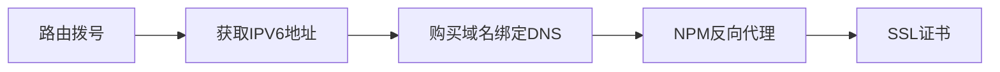

# 公网访问`DDNS`+`IPV6`

> 近期由于自己搭建了一个类似`Nas` 的软件, 所以有外网访问家中路由(服务器)的需求. 最快捷的方法就是有一个公网ip, 但是现在`IPV4`地址有这么稀缺, 所以这一方案就只能暂时pass. 同时, `Zerotier` 和`Tailscale` 的速度也依赖于隧道两端服务器, 不够稳定, 且速度也远远达不到直连的效果, 每次登陆都要开代理, 所以就需要寻找其他方案. 
>
> `IPV6` 是新一代的ip地址协议, 其为了解决`IPV4` 地址不够使用的问题而诞生, 数量级相比于`IPV4` 是N多倍, 所以几乎每个路由都有一个`IPV6` 地址. 因此, 我们可以借用`IPV6`进行公网访问.

为了能够实现公网访问, 本文会涉及到方面, 大致流程如下所示:

后续也主要是基于这个步骤来描述.

## 1. 光猫桥接

因为``IPV6``地址很长, 同时又不好记忆, 所以在日常网页访问过程中直接使用`IPV6`地址是不现实的, 这就需要用到域名来映射`IPV6`地址, 进行实现快捷访问, 这就是`DNS` ( Domain Name System).

此外, 虽然每一台路由器都有一个公网`IPV6`地址, 但是运营商每隔一段时间会重置我们的`IPV6`地址, 所以我们要动态的更新我们的域名和`IPV6`地址的映射关系, 也就是``DDNS`` (Dynamatic Domain Name System).

一般来讲, 我们自己配的路由器性能会更好一点, 所以为了更好的进行``DDNS``, 发挥路由器的效果, 我们首先需要选择``DDNS``适配不错的路由器, 然后使用路由器进行拨号, 光猫桥接, 借助路由器的``DDNS``将自己的域名和`IPV6`地址进行一个动态更新.

在这一步, 我们先进行光猫桥接, 路由器拨号的操作.

首先需要进入光猫的后台, 一般为`192.168.1.1`, 同时我们需要根据光猫的型号去网上查找超管密码, 没有超管密码改不了光猫的连接方式.

以我现在租房子移动给的`ZN-R173G` 为例:

光猫账号密码为: `CMCCAdmin`  和 `aDm8H%MdA`

除此之外, 我们还需要自己宽带的账号和密码, 这两个可以打运营商电话获取.

### 1.1 后台信息

进入路由器后台后, 我们可以看到光猫的一些连接信息, 其中表格中第一行 `4_INTERNET_R_VID_4031` 就是我们光猫和互联网连接使用的通道, 记住最后的`VID: 4031` , 后面我们新增桥接模式的时候要用到.

随后我们进入网络栏, 找到这个连接, 将所有的配置都记录下来.

### 1.2 光猫设置

进入网络栏后, 找到上面说的连接, 进行删除, 然后创建一个新的连接.

在出现的配置中, 选择模式为桥接, 类似下面的图, 不过这里需要把`Vlan ID` 换为上一小节记录的`VID`, 如果是`4031` , 那么就填`4031` . 其他和之前保持一致就行, 如下:

### 1.3 路由器拨号

进入路由器的配置页面, 我这里暂时使用斐讯k2为例子, 修改保存后路由器自动重启, 此时就是路由器拨号了.

:::tip

有些地方可能需要将**光猫的mac地址复制下来**, 在下面的高级设置里面设置下, 否则移动那边不响应. 

:::

## 2. 获取IPV6地址

因为之前的斐讯k2不支持`IPV6` , 拨号后也获取不到地址, 所以只能购入新的设备了.现在买的是`Tplink 6088` , 本来以为配置后台会好一点, 然后能用它自带的`DDNS`, 但是用了后发现其实很鸡肋, 性价不高, 如果没有`2.5G` 需求, 可以考虑其他便宜一些的路由器.

### 2.1 路由设置和连接

重复上一节路由器拨号部分, `6088` 的拨号设置页面如下所示:

也是和斐讯一样设置账号就行了.

:::tip

这里有需要注意的一点, 路由器需要支持关闭`IPV6`防火墙, 不然外网访问不了. 具体位置如下

:::

### 2.2 查询地址

这一步设置好之后, 连上主机(服务器), 获取`IPV6`地址, 一个比较简单的方式是使用命令行`curl 6.ipw.cn` 去获取`IPV6`地址, 更多的命令行可以看[这里](https://ipw.cn/`IPV6`/). 另一种就是使用服务器自带的ip命令去查询了, 一般移动的前缀是`2409` , 其他运营商的可以在网上查下.

## 3. 域名购买与DNS和`DDNS`

### 3.1 域名购买

这里分为免费和付费两种.

- 免费域名

免费的域名可以自己查找一下, 我感觉比较好的是`dynv6` , 虽然只是二级域名, 但是他免费啊, 而且前期可以用来自己测试能否跑通, 跑通了就可以换为付费域名了.

- 付费域名

国内的一般都要进行备案, 不但麻烦还比较贵, 于是我把目标放到国外域名商. 很多国外的域名商卖的也贵, 正好有次看到有网友说`google domain` 上土耳其区域名便宜, 就上去看了下, 一个十年的域名最低只要200米(750土耳其币), 还能选`org` 这种后缀的域名, 可以说很值了. 如下(要先选择土耳其区)

但是这里要注意两点, `google domain` 要求要有**visa或者万事达信用卡**, 不然没办法付款, 不支持`PayPal` ; 而且`google domain` 的域名服务可能要被其他公司收购了.

> 我为了能购买, 专门申请了一张visa(当然我也是想简单混下卡圈, 这些信用卡的东西后面有时间再说)

### 3.2 DNS配置

一般来讲, 你的域名在哪购买的, 就可以在哪进行`DNS` 配置, 但是开源工具对`google domain` 的 `dns` 服务支持没那么好, 所以我使用了支持情况比较好的``Cloudflare`` , 上面添加站点后可以进行免费`DNS` . 从`google domain` 转移到``Cloudflare`` 的流程如下:

1. 先在``Cloudflare``上添加自己的域名, 随后进入域名详情里面, 找到分配的服务器, 将其复制下来.

2. 其次在`google domain` 上选择使用自定义域名服务器, 将上一步的两个服务器地址粘贴在输入框即可.

这样我们就成功替换了`DNS` 服务商.

3. 回到`Cloudflare`上, 配置自己的`DNS`

在这里因为我们只有`IPV6`, 所以添加记录的时候选择类型为`AAAA` 就行, 然后在名称里面填上自己的域名(如`example.com` ), 后面填上自己的`IPV6`地址.

如果自己有一些子域名, 比如`home.example.com`, 或者`happy.example.com` 等, 我们就可以使用一个泛域名来进行解析, 也即新增类型`CNAME`, 名称填`*` , 其他内容不填即可.

### 3.3 DDNS-GO部署

这里的部署比较简单, 直接看项目地址或者网上搜索就行.下图就是主要的配置页面

:::tip

1.  如果你的内网有两台机器`a` 和`b` , 你在机器`a` 上部署, 想在机器`b` 上打开配置页面, 那么就要先把机器`a` 上的`9876` 防火墙打开, 否则机器`b` 打不开配置页面.

2. 这里``Cloudflare`` 的`token` 是需要去手动创建的, 不等效于`global key`, 具体可以参考[这里.](https://abigalefocus.medium.com/%E6%9E%B6%E7%AB%99%E7%AD%86%E8%A8%98-%E7%AE%A1%E7%90%86`Cloudflare`-api-tokens%E5%92%8Ckeys-1bd6ad24883e)
2. 如果只有``IPV6``, 那么就把`IPV4`的关闭.

:::

## 4. NPM反向代理和SSL证书申请

在进行完上面三部分后, 其实我们就可以访问自己的服务器了, 当然前提是服务器上部署了相应的服务且打开了相应端口的防火墙. 连接形式为`xxx.example.com:9898` 

但是这样的话我们有一个端口部署了相应的服务就需要开一个防火墙, 此外每一次访问都是不安全连接, 有很大的风险, 因此我们就需要使用`NPM` (nginx proxy manage) 进行反向代理和SSL加密.

:::tip

这里反向代理的软件还有`lucky` 和 `NginxWebUI` , 前者还是挺好的, 内部集成了``DDNS`` 和 `SSL` 证书申请, 全套链路, 但是最新的版本没有开源. 后者是配置页面感觉不是很好, `nginx` 的重启比较麻烦, 所以使用了`NPM` .

:::

### 4.1 NPM部署

这里的`NPM` 不是前端的`NPM` 包管理器, 是`nginx proxy manager` 的缩写. 其是一个可视化的`nginx` 工具, 用户在上面可以快速创建一个代理, 同时还能快捷申请`SSL证书` . 这样的话, 我们只需要开放一个端口, 然后使用二级域名, 加上`NPM` 的反向代理, `SSL` 的加密, 即可极大程度的降低外网访问的风险. 

部署可以直接参考官方教程, 登录页面后让你改用户名和密码, 随后你就可以自己配置了. 这里可以直接参考b站的一个视频: https://www.bilibili.com/video/BV1Ws4y1A7Lk

:::tip

由于我们目前是在家庭宽带上进行服务器部署, 宽带运营商会直接屏蔽`80/443` 端口, 因此我们部署`NPM` 的时候需要将`80/443` 映射为其他开放端口(`docker-compose.yml` 文件需要更改为其他端口). 

:::

### 4.2 证书申请

这里单独拿出来主要是因为如果使用家用宽带, 通过`NPM` 的专门`SSL` 申请页面很难申请到证书, 一直会报服务端错误, 这里有两种解决方案.

1. 在具体的反向代理里面为子域名单独申请, 这里是可以申请成功的.(比较推荐, 只是创建的时候稍微麻烦一点)
2. 使用`NginxWebUI` 来申请证书, 然后再下载下来传到`NPM` 上.(不太推荐, 不支持自动刷新)

经过上述配置后, 我们就可以使用`https` 来访问我们的网站了, 这里因为家用宽带443端口被屏蔽, 所以我们假设部署的时候使用`4443` 端口来映射, 那么访问地址就会类似于: `happy.example.com:4443` , 如下所示

## 5. 小结

本文到这里也就结束了, 从刚开始部署自己的小主机到现在断断续续有快一年了, 从刚开始的`Zerotier` 到`Tailscale` , 终于到现在可以通过域名直接访问了. 文中有有很多内容来自网上一些大佬的分享, 我才能把这些流程跑通, 原理搞明白, 希望以后自己也能在不断探索中在互联网上贡献一些技能和经验.

