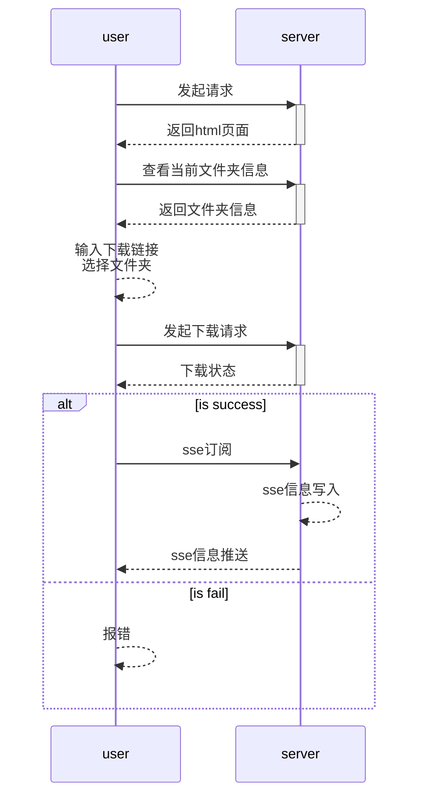

# 客户端控制服务端下电影

> 上周末在家看到群里有人分享电影的链接, 就点进去看了下. 因为之前自己有用`aria2` 去下载电影, 但是效果十分的差, 经常没有节点(当然也可能是资源不太ok), 所以就想有没有直接下载的方式. 
>
> 这个的电影分享链接是某个出名的公有云上的, pc页面打开后不支持直接下载, 要通过客户端去进行下载, 毕竟大家都要推广自己的客户端, 这也是可以理解的. 但是我想的是能不能绕开他这个pc页面的限制, 直接通过链接下载.
>
> 正好之前关注一个b站up主`koala聊开源`, 做了一个开源的应用便于用户从小程序上查看每周程序员的热点技术等. 小程序中有一个功能是支持点击后直接跳到b站视频的具体节点, 在当时直播分享的时候up主的技术伙伴(儿子/小程序开发者) 讲了他是怎么通过一步步调试碰巧找到了实现b站精准这个功能的方案. 
>
> 因此也就有了后续的探索.


## 探索

在网上初步搜索后, 有两个方案:

1. 将`disabled` 的按钮放开
2. 模拟手机用户, 添加`m.` 前缀访问网站


试验后两种方案均被pass, 所以就自己试. 后来还真的被试出来了, 具体的流程是:

1. pc直接点击链接, 打开页面
2. 设置为h5模式, 此时链接会自动添加`h5.` 前缀(怪不得`m.` 的前缀不生效)
3. 再将网页设置为pc模式, 此时链接依然是`h5.` 前缀, 但是此时下载按钮可以点击

经过上面的流程, 点击下载按钮, 就可以通过浏览器直接下载, 绕开了网页下载的限制

> 当然, 这种方式十分的费人力也不优雅, 所以后续会继续探索自动获取下载链接的方法


## 初步成果

首先看简单的样子:


用户可以通过访问远端页面实现控制服务端下载的功能, 页面比较简陋, 功能也比较简单(**只支持url直接下载**), 但是相关需求结合起来要去实现还是挺锻炼人的.

项目的整体流程为:




技术构成:

- nodejs (后台服务, 负责可视化页面, api交互和文件信息查阅)

- sse (用于实现下载进度监听)

- XMLHttpRequest (发起请求, 和服务端交互)


具体实现如下所示

### 一. 监听具体端口, 实现可视化视图的传递

项目在服务端使用pm2在后台启动, 每当有用户发起请求的时候服务端就会将上图的可视化页面返回给用户, 用户基于这个页面进行一些简单的点击即可进行文件的下载

```javascript
const app = express()
// 指定静态文件夹
app.use(express.static('public'))

// 返回html文件
app.get('/', (req, res) => {
  res.writeHead(200, { 'Content-Type': 'text/html' });
  res.end(fs.readFileSync('index.html'))
})
```


### 二. 监听用户请求, 实现请求处理与响应, 如下载, sse等

在上一部分返回的html中, 由于是简单的接口调用, 所以当时考虑不再引入第三方库, 直接使用了原生的XMLHttpRequest和sse, 客户端只需要调用接口通知服务端, 接受服务端推送的信息即可. 

客户端的下载代码如下

```javascript
downloadEle.addEventListener('click', () => {
  const url = urlEle.value
  const filePath = baseFolderEle.innerText
  if (!url) {
    alert('请输入url')
    return
  }
  const data = JSON.stringify({
    url,
    filePath
  })
  xhr.open('POST', `/download`)
  xhr.setRequestHeader('Content-type', 'application/json; charset=utf-8');
  // 真正发起请求
  xhr.send(data)
  // 响应回调, 判断是否下载成功, 下载成功就创建sse监听
  xhr.onload = function() {
    if (xhr.status !== 200) {
      // 错误警告 例如 404: Not Found
      speedEle.innerText = `Error ${xhr.status}: ${xhr.statusText}`;
    } else {
      // 创建监听
      createListen()
    }
  };
})
```


sse下载进度监听

客户端代码:

```javascript
let sse = null
const createListen = () => {
  sse = new EventSource('/subscribe')
  sse.addEventListener('connected', (e) => {
    console.log('connected')
  })
  sse.addEventListener('open', (e) => {
    console.log('open')
  })
  sse.addEventListener('message', (e) => {
    const { data } = e
    speedEle.innerText = data
  })

  sse.addEventListener('error', (e) => {
    speedEle.innerText = '下载失败'
    sse.close()
    sse = null
  })
}
```

服务端代码:

```javascript
// 将此段代码放到下方axios下载的回调中
const cb = (progressEvent) => {
  const { total, rate, progress } = progressEvent
  if (total && sseResponse) {
    if (progress !== 1) {
      const text = `总大小: ${(total/1024/1024).toFixed()}M 下载进度: ${(progress * 100).toFixed(2)}% 下载速度: ${(rate/1024/1024).toFixed(2)}Mb/s`
      sseResponse.write(`data: ${text}\n\n`);
    } else {
      sseResponse.write(`data: 下载完成\n\n`);
    }
  }
}

// 服务端下载
axios.get(url, {
  headers: {
    Accept: '*/*',
  },
  responseType: 'stream',
  onDownloadProgress: function (progressEvent) {
    // 回调: 通知调用方下载的进度
    cb(progressEvent)
  }
})
```


### 三. 获取服务端文件夹信息, 便于用户选择, 省去手动输入的繁琐

由于下载需要指定下载的路径, 以及文件的名字, 所以后面又增加了获取服务端文件信息的功能.

客户端获取服务端文件信息, 由于无数据库, 所以这里暂时在客户端代码里写死了根目录

```javascript
// baseFolderEle.innerText === '/xxx/xxx/test'
const renderFileInfos = (files) => {
  const fileInfosEle = document.querySelector('.file-infos')
  if (files.length === 0) {
    fileInfosEle.innerHTML = '暂无文件'
    return
  }
  fileInfosEle.innerHTML = files.map(item => {
    if (item.isDirectory) {
      return `<li class="directory">${item.name}</li>`
    } else {
      return `<p>${item.name}</p>`
    }
  }).join('')
  const directoryEles = document.querySelectorAll('.directory')
  directoryEles.forEach((ele) => {
    ele.addEventListener('click', (e) => {
      const { target } = e
      const path = `${baseFolderEle.innerText}/${target.innerText}`
      queryFolderInfo(path)
    })
  })
}
```

服务端文件信息读取

```javascript
// 组装文件夹信息
const constructFolderInfo = (path, files) => {
  return files.filter(file => !file.startsWith('.')).map(file => {
    return {
      name: file,
      isDirectory: fs.statSync(`${path}/${file}`).isDirectory(),
    }
  })
}

// 读取文件夹信息
const queryFolderInfo = (path = '/') => {
  return new Promise((resolve, reject) => {
    fs.stat(path, (err, stats) => {
      if (err) {
        console.log(err)
      } else {
        if (stats.isDirectory()) {
          fs.readdir(path, (err, files) => {
            if (err) {
              reject(err)
            } else {
              resolve({
                files: constructFolderInfo(path, files),
                basePath: path,
              })
            }
          })
        } else {
          reject('not a folder')
        }
      }
    })
  })
}
```


## 其他

这个项目还是很粗糙的, 现存的获取资源下载链接的方式还纯依靠手动, 即切换网页为h5, 然后在切换回来手动点击下载获取.周末花了一点时间看了下, 目前只是有了一点简单的眉目, 但是具体请求的组成还要再看看编译后的代码.

后续如果能逆向分析到接口请求的逻辑再更新一版(不过逆向成功的可能性比较低, 涉及到uuid), 这样项目能根据其他人的分享链接自动获取下载链接, 不用再手动切换处理..

