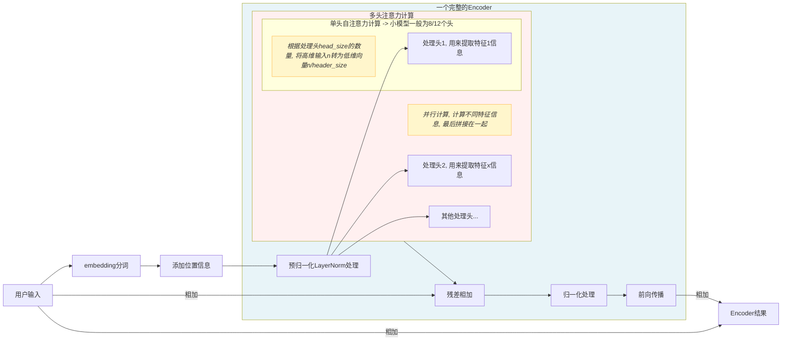
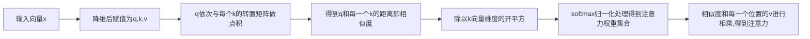

# Transform模型初步探索

## 基本流程




自注意力计算流程图



自注意力计算示意


## 基本原理

transform模型的核心其实是自注意力, 即模型开始关注输入中每个字符之间的关联. 模型首先会有一个很大的字符表, 用来映射输入的每一个字符, 类似于码表, 同时还会有一个专门的embedding分词工具, 把每一个输入在一个512维的张量上进行展示, 如我们输入为: 天气, 那么经过embedding后结果就是

```
[
// 512维
​	[x, x, ..., x]

​	[x, x, ..., x]

]
```


因为我们需要计算输入中每个字符之前的关系, 如"我喜欢你"和"你喜欢我"是两个完全不同的意思, 所以肯定需要知道每个字符的位置. 但是刚才embedding后的结果很明显没有位置信息, 因此需要再加上位置信息.

上面得到的向量可以分为两个部分，奇数和偶数部分。奇数部分使用cos函数，加上当前token的位置信息pos，通过cos编码得到一个奇数编码值；偶数部分使用sin函数，加上当前token的位置信息pos，通过sin编码得到一个偶数编码值, **最后拿token的embeddings和pos的embeddings相加，得到位置编码后的positional input embeddings**。这也是正是Transform中的绝对位置编码Sinusoidal, 计算公式为:

```latex
PE(pos,2i)=sin(pos/100002i/dmodel)PE(pos,2i+1)=cos(pos/100002i/dmodel)
```


