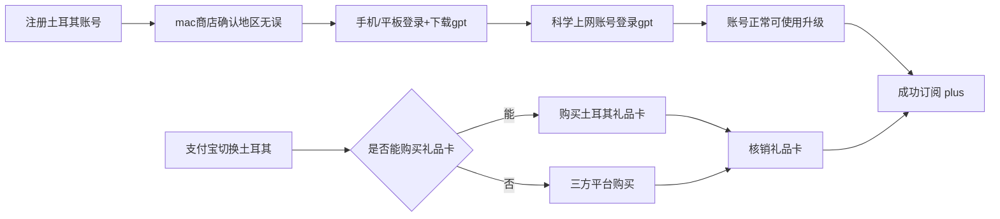

# APPLE GPT plus 土耳其订阅

所需清单: VPN + Mac 电脑(确认地区) + 苹果手机/平板

大致流程如下:

## 一. 账号注册与确认

> 这一步是最重要的, 这一步弄完后面就简单了

无痕浏览器打开网址: https://account.apple.com/account

填写地区为**土耳其**, 邮箱可以用国内的, 但最好用 google 或者其他国际邮箱

注册成功后打开 mac 商店, 登录你的新账号, 这一步是为了确认你的账号地区成功注册到了土耳其, 有些账号会自动改到国区, 所以如果改到国区的话要手动改回来. 为什么必须使用 mac 呢? 因为使用其他端该地区必须要绑定土耳其的信用卡, mac 端可以规避这个限制.

如下图, 地区是土耳其就没问题

## 二. 账号登录与查看

苹果手机/平板商店登录新账号, 下载 chatgpt plus app, 如果之前下载过, 最好卸载后用新的土耳其账号重新下载一次(有的人遇到过旧的 app 不能成功订阅的问题).

## 三. 礼品卡购买与订阅

支付宝切换为土耳其地区, 然后搜索礼品卡, 有的账号能搜到, 有的搜不到.

搜不到的话可以自己找一个三方平台, 然后购买土耳其的礼品卡就行

> 我自己在一个平台上买了两次, 即买即用, 不保证后续好用, [网址](https://www.seagm.com/zh-cn/itunes-gift-card-turkey?item_id=16820)

礼品卡购买成功后查看核销码, 然后使用土耳其账号登录商店, 核销即可. 

核销完毕就能在 chatgpt 中订阅 plus了, 一个月 80 人民币搞定.