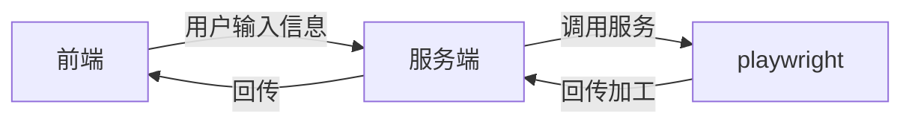
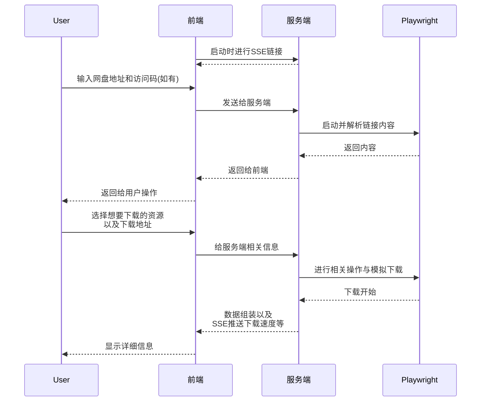

# XX云盘简易化下载记录

> 事情的起因是之前有过一段时间捣鼓 NAS, 犯了仓鼠囤积症, 想着把能找到的一些好视频都保存到本地的 NAS 中, 于是搜索 PT 等下载源. 后来发现有个资源站上很多资源, 都是XX网盘的, 而正好之前该网盘我发现了一个可以进行 web 下载的缺口, 因此计划基于该缺口进行包装开发. 本文主要介绍下整体项目构成, 流程图, 相关难点, 以及最后的总结.


## 一. 项目整体构成

项目视图:


因为本项目最核心的其实就是网页后台的自动操作, 所以为了实现WEB自动化处理, 想到了一些自动化测试的工具, 如 playwright , lightpanda, puppuer 等, 最后测下来 playwright 效果最好, 便将其作为基础进而构建了下面的大体框架:



为了感受下一些新的技术, 所以选择了下面的技术栈:

- React
- Rsbuild
- Biome
- Nest
- Playwright


## 二. 项目主要流程

主要的流程图如下:




## 三. 项目难点

在完成项目的过程中相关难点主要有两部分, 其中第一部分是最难, 具体如下:

1. Playwright的模拟与鉴权处理
2. 服务端开发与调试部署

###  难点一: Playwright的模拟与鉴权处理

- 设备和真实场景模拟

  - 该 web 下载的缺口其实是把web端改为h5端链接, 然后刷新页面, 此时可以点击下载按钮进行下载, 所以需要启动的时候就将Playwright的device模拟成安卓手机(这里苹果手机测试是不行的), 这样即使输入的是web链接, Playwright调用后也不用额外操作去切换.

- 登录鉴权处理

  - 因为下载其实走的还是网盘自己的链路, 所以需要登录网盘. 一种方式是启动Playwright就到登录页面进行登录, 这种方式初看比较简单, 省去了后续用户触发下载时候再进行登录的后台处理难度, 但是比较有割裂感, 所以后面采取了另一种方式: 用户点击下载的时候进行登录并保存用户信息. 

  - 具体来说, 用户点击下载后, Playwright会点击网页上的下载按钮, 如果此时用户没有登录, 那么网页会出现登录弹窗, 此时判断的到登录视图, 服务端就会触发一个输入手机号的SSE推送给前端, 该推送会有60s倒计时(前端暂时未完善), 前端填写完成后发送给服务端, 服务端模拟触发网页上的发送验证码操作, 随后继续触发一个输入验证码的SSE给前端(同样是60s), 前端填写完成后发送给服务端, 然后由Playwright填入, 登录成功. 登录成功后会把用户的cookies缓存起来, 减少鉴权.

    流程图如下:

    ```mermaid
    sequenceDiagram
        participant 前端
        participant 服务端
        participant Playwright
        前端 ->> 服务端: 选中想要下载的文件<Br>发送给服务端
        服务端 ->> Playwright: 递归文件并选中点击下载
        Playwright -->> Playwright: 判断
        alt 已经登录了
            Playwright-->>服务端: 触发下载
        else 未登录
            服务端-->>+前端: 需要登录, SSE推送手机号码填入
            前端-->>服务端: 返回手机号码
            服务端-->>Playwright: 填入手机号码
            服务端-->>前端: SSE推送验证码填入
            前端-->>-服务端: 返回验证码
            服务端-->>Playwright: 填入验证码
            Playwright-->>Playwright: 登入成功, 保存cookies<Br>
            Playwright-->>服务端: 触发下载
        end
        服务端->>前端: 正式下载
    ```

- 模拟下载点击

  - 我们这里的下载走的是网盘自己的下载, 即触发后网盘会返回一个下载地址, 如果不管的话浏览器会触发自动下载, 所以我们要阻止浏览器的自动下载, 然后自己用这个下载地址去下载.
  - 这里首先需要递归进入每一个层级, 遍历查看文件是否要下载; 触发下载后, 取消浏览器的下载行为, 使用自己的下载逻辑, 下载完毕后, 下载下一个文件, 重复上面步骤.

### 难点二: 服务端开发与调试

- 一方面是因为自己服务端开发的少, 虽然之前也弄过一些日志系统, 但是没有体系, 所以做这个项目的时候也没有一开始就搭建, 后面部署后发现各种问题难于排查;
- 另一方面就是本地开发环境和部署后的环境有很多不同, 使用docker部署后遇到了没有权限, 路径不对等问题, 后面也是配置日志慢慢调了过来.


## 四. 总结

做这个项目一方面是兴趣使然, 想要快捷存一些资源到NAS中(网页下载还要转一下); 另一个就是想要看看nest开发起来是什么体验. 目前做完后自己只是入门能正常启动, 感觉良好, 不过一些日志, 里面的一些理念, 都没有很好的去学习, 有机会学习后项目的结构肯定会比现在好许多倍. 后面还有另外的一个构思项目, 这个项目计划借用AI去开发, 正好体会下AI写出来的nest项目是什么样的, 到时候也会再写个总结对比下.

